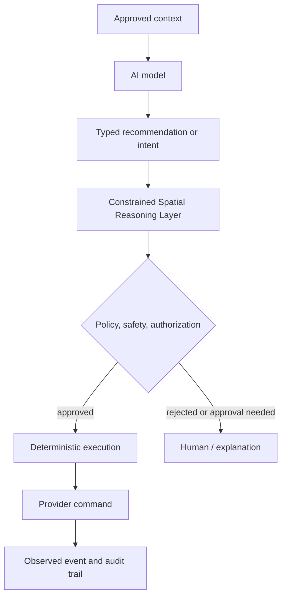

# AI Architecture

## Role

AI is a native OSIP capability for interpreting approved context, explaining the environment, recommending actions, assisting installers, detecting anomalies, and eventually coordinating tasks. It is not the authority for safety or access control and cannot bypass deterministic policy, authorization, audit, or manual control.

## Execution modes

| Mode | Suitable work | Boundary |
| --- | --- | --- |
| Private local inference | Sensitive context, low-latency assistance, offline use, and constrained language models. | Runs on OSIP Edge or a dedicated trusted local-network AI host; no default egress and no control authority. |
| Cloud inference | Optional high-capacity reasoning, analysis, and improvement. | Requires explicit data classification, consent, egress policy, and a useful degraded local experience. |
| Constrained Spatial Reasoning Layer | Spatial/contextual interpretation, policy-bounded intent resolution, explainable recommendations and execution plans. | Does not require an AI model; AI output is only an input to this Layer. |
| Deterministic execution | Safety rules, core comfort control, accepted-plan execution, command validation, and hard constraints. | Does not require an AI model and remains authoritative during model or WAN failure. |

## Controlled action path

An AI component receives only the contextual information and tools permitted for its role. A tool invocation becomes a typed intent or recommendation, which the Constrained Spatial Reasoning Layer evaluates against digital-twin evidence, policy, and authorization before deterministic execution issues a command. The system records the input reference, model/tool version, proposed intent, CSRL/policy result, actor, and observed outcome. Secrets, unrestricted broker access, and raw administrative commands are never model tools.

## Memory, privacy, and evaluation

AI memory is separated into: immutable installation facts from the digital twin; current state from approved projections; user preferences with ownership and retention; and derived working memory with expiration. Each store declares data classification and whether it can leave the installation.

Every AI feature begins with a user or installer job, a non-AI fallback, acceptance tests, harmful-action analysis, and an explanation expectation. Evaluate usefulness, error rate, refusal correctness, privacy conformance, latency, cost, and the ability to reconstruct consequential recommendations. Model choice is an implementation decision and must not redefine OSIP's domain contracts.

The model-routing decision is policy-controlled: a private request is never silently sent to a cloud model. See [AI Model Deployment Strategy](ai-model-deployment-strategy.md) for accepted deployment profiles and selection evidence.
