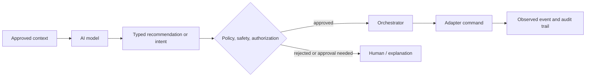

# AI Architecture

## Role

AI is a native OSIP capability for interpreting approved context, explaining the environment, recommending actions, assisting installers, detecting anomalies, and eventually coordinating tasks. It is not the authority for safety or access control and cannot bypass deterministic policy, authorization, audit, or manual control.

## Execution modes

| Mode | Suitable work | Boundary |
| --- | --- | --- |
| Local inference | Sensitive context, low-latency assistance, offline use, constrained models. | Runs within the installation's trust boundary and is resource-limited. |
| Cloud inference | Optional high-capacity reasoning, analysis, and improvement. | Requires explicit data classification, consent, egress policy, and a useful degraded local experience. |
| Deterministic automation | Safety rules, core comfort control, command validation, hard constraints. | Does not require an AI model and remains authoritative during model or WAN failure. |

## Controlled action path

An AI component receives only the contextual information and tools permitted for its role. A tool invocation becomes a typed intent, which is evaluated by policy and authorization before an orchestrator issues a command. The system records the input reference, model/tool version, proposed intent, policy result, actor, and observed outcome. Secrets, unrestricted broker access, and raw administrative commands are never model tools.

## Memory, privacy, and evaluation

AI memory is separated into: immutable installation facts from the digital twin; current state from approved projections; user preferences with ownership and retention; and derived working memory with expiration. Each store declares data classification and whether it can leave the installation.

Every AI feature begins with a user or installer job, a non-AI fallback, acceptance tests, harmful-action analysis, and an explanation expectation. Evaluate usefulness, error rate, refusal correctness, privacy conformance, latency, cost, and the ability to reconstruct consequential recommendations. Model choice is an implementation decision and must not redefine OSIP's domain contracts.
