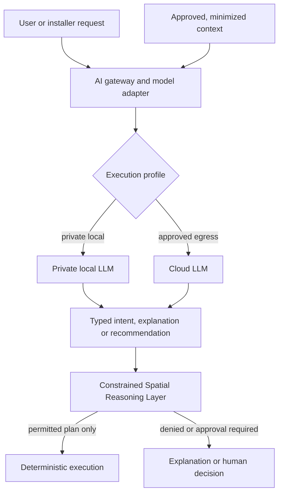

# AI Model Deployment Strategy

## Purpose

OSIP supports AI without making a particular model, vendor, or cloud service part of the platform’s architecture. This strategy defines the supported execution profiles for language models and other inference services. It preserves three non-negotiable properties: a private option for sensitive environments, optional use of higher-capacity cloud models when justified, and a deterministic non-AI path for critical operation.

Model names are deliberately not selected here. A locally deployable model such as a future GLM-family model may qualify, as may another model, only after it satisfies the evaluation, licence, privacy, operational, and hardware criteria in this document.

## Execution profiles

| Profile | Placement | Suitable work | Boundary |
| --- | --- | --- | --- |
| No-model baseline | OSIP Edge only | Critical control, safety, policy evaluation, deterministic execution, and all declared `edge-required` functions. | Always available; does not call an AI model. |
| Private local LLM | OSIP Edge where resources allow, or a dedicated trusted server in the customer’s local network. | Private natural-language interaction, explanation, installer assistance, constrained intent interpretation, and local knowledge retrieval. | No default egress; model service receives only approved context and remains optional. |
| Approved cloud model | Explicitly approved external AI service. | High-capacity analysis, complex language work, optional model improvement, or workloads beyond local hardware. | Requires data classification, consent where applicable, explicit egress, provider agreement, and a useful non-cloud fallback. |

The private local LLM is not required to run on the same small device that performs radio integration or critical control. A deployment may use a resource-constrained Edge runtime for deterministic functions and a separate, local-network AI host for optional inference. The loss of that AI host is an observable degraded mode, not a loss of control.

## Mandatory model boundary

Every model is accessed through an OSIP AI model adapter. The adapter identifies the model/version and execution profile; applies authentication, rate, cost, and context limits; records attributable request/response metadata; and exposes only approved, typed operations. It does not grant broker administration, raw actuator commands, unrestricted database access, or unrestricted raw telemetry.

Structured output is preferred for every model operation: a versioned intent, recommendation, explanation, or retrieval result validated against a schema. Natural-language text alone is not a command contract. This, together with CSRL and policy validation, makes results more consistent than trusting a model response directly.

## Initial permitted roles

The first private or cloud LLM integrations may:

- translate an authenticated request into a typed intent or ask a clarifying question;
- explain an observed OSIP state, plan, decision, or degraded condition;
- help an installer find approved documentation and prepare non-executing commissioning checklists;
- summarize diagnostics already authorized for the requesting role; and
- suggest a recommendation or anomaly for CSRL/human review.

They may not bypass policy, interpret ambiguous speech as authority for a consequential action, issue a provider command directly, decide safety interlocks, or turn on cloud egress by default.

## Selection and acceptance criteria

A candidate model and runtime are evaluated per execution profile. Selection evidence must include:

- supported languages and quality for the intended user population;
- reliability of schema-constrained, typed output and safe handling of ambiguity;
- latency, throughput, context capacity, and concurrent-use behaviour on the target private hardware;
- memory, accelerator, power, thermal, packaging, update, rollback, monitoring, and recovery requirements;
- licence terms, commercial rights, model provenance, update policy, and vulnerability response;
- privacy/data-retention behaviour, telemetry, network egress, access control, and audit capability;
- an evaluation corpus derived from approved OSIP intents, explanations, refusal cases, and adversarial prompts; and
- a deterministic fallback and disablement procedure.

The model is not accepted merely because it produces fluent answers. It must meet the stated role’s safety, privacy, operational, and consistency criteria in the Reference Apartment before becoming part of an Installer Edition profile.

## Routing rules

Routing is a policy decision, not an application convenience:

1. Prefer the no-model baseline when an AI capability is unnecessary.
2. Use a private local LLM when the feature is allowed locally and the required quality/cost/latency fit the available private hardware.
3. Use a cloud model only when its additional value is explicit and policy permits the classified context to leave the trusted environment.
4. If an eligible model is unavailable, return a safe explanation, defer to a person, or use the deterministic workflow. Never silently switch a private request to cloud.

## Related documents

- [AI Architecture](ai-architecture.md)
- [AI Capability Roadmap](ai-capability-roadmap.md)
- [Constrained Spatial Reasoning Layer](../architecture/constrained-spatial-reasoning-layer.md)
- [Edge Runtime](../architecture/edge-runtime.md)
- ADR-0007 — AI-Native, Runtime-Optional Operation
