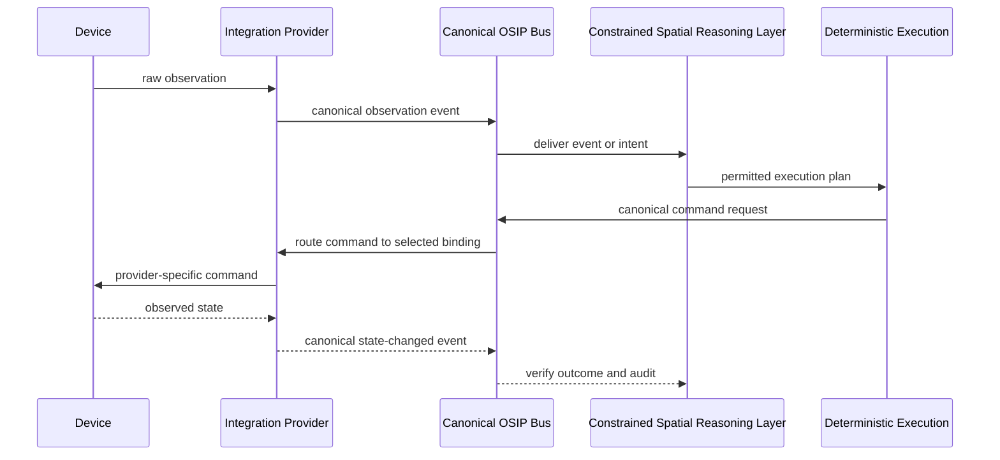

# Architecture Overview

## Scope

OSIP is a set of independently replaceable capabilities that turn physical signals and user intent into safe, observable outcomes. This document defines the logical boundaries. It does not select a final implementation for every boundary.

The reference architecture is local-first: the OSIP Edge runtime owns declared critical control, the Constrained Spatial Reasoning Layer, deterministic execution, the relevant spatial/asset state, policy, and the local canonical bus. Integration providers such as Home Assistant, Zigbee2MQTT, BACnet, KNX, MQTT bridges, and vendor APIs are replaceable southbound infrastructure. Fleet/control-plane and external AI services enhance explicitly permitted experiences but cannot be required for baseline operation.

## System context

The C4 source remains versioned in `diagrams/c4-system-context.puml` at the repository root; MkDocs generates the following SVG during every build. It deliberately represents Home Assistant, MQTT, Zigbee2MQTT, and cloud/model providers as replaceable external systems rather than OSIP's core.

The companion C4 container view is generated from `diagrams/c4-container-view.puml`.

## Logical layers

| Layer | Responsibilities | Must not own |
| --- | --- | --- |
| Physical environment | Sites, buildings, spaces, assets, people, engineering equipment, and local manual controls. | Provider-specific identity or policy. |
| Integration providers | Protocol translation, discovery, binding lifecycle, normalisation, health, raw diagnostics, and capability mapping. | The OSIP domain model, cross-provider policy, or application API. |
| Canonical bus | Contracted canonical events and routed commands, correlation, retry, and observable delivery. | Hidden device-specific semantics or a mandate that every device uses one transport. |
| Constrained Spatial Reasoning Layer | Spatial/contextual interpretation, constraint evaluation, intent resolution, explainable recommendation or execution plan. | Protocol translation, direct actuator authority, or a second policy model. |
| Deterministic execution | Approved-plan execution, narrow local rules and schedules, command verification, and conservative failure behaviour. | Reinterpreting consequential goals or bypassing CSRL/policy. |
| Applications | Operator, tenant, installer, and vertical applications using space, asset, capability, and policy-scoped intent APIs. | Direct privileged provider control that bypasses policy and audit. |
| Fleet/control plane | Multi-site inventory, versioned configuration/policy distribution, rollout, health, drift, and remote support. | A synchronous dependency for a declared local critical path. |

## Runtime paths

A normal path starts with an observation or requested intent. A provider normalises an external fact; the canonical bus distributes a versioned event; the edge twin relates it to a site, space, asset, capability, and binding; the Constrained Spatial Reasoning Layer and policy choose an allowed plan; deterministic execution dispatches a command through an eligible provider; and the resulting state is observed and audited.

The command is not assumed successful until an authoritative acknowledgment or observed state establishes it. Timeouts, duplicates, and partially connected devices are normal operational cases.

## Architectural invariants

- The core domain does not import vendor-specific identifiers as its primary identity.
- A provider is replaceable; Home Assistant is a valuable provider, never a mandatory OSIP foundation.
- Constrained Spatial Reasoning Layer makes spatial, policy-bound decisions; deterministic execution executes approved decisions and narrow technical rules.
- The canonical bus unifies semantics, not necessarily physical-device transport.
- A cloud or AI service does not receive privileged control merely because it can recommend an action.
- Safety-relevant actions pass through explicit policy, authorization, audit, and manual-override rules.
- Events remain useful to independently developed consumers through documented contracts and versioning.
- Every automation path has enough telemetry to reconstruct what happened and why.

## Related specifications

- [Event Model](event-model.md)
- [Message Bus](message-bus.md)
- [Physical Asset Model](physical-asset-model.md)
- [Integration Providers](integration-providers.md)
- [Constrained Spatial Reasoning Layer](constrained-spatial-reasoning-layer.md)
- [Intent, Policy, and Execution](intent-policy-and-execution.md)
- [Edge Runtime](edge-runtime.md)
- [Fleet and Control Plane](fleet-control-plane.md)
- [Digital Twin](digital-twin.md)
- [Security Architecture](security-architecture.md)
