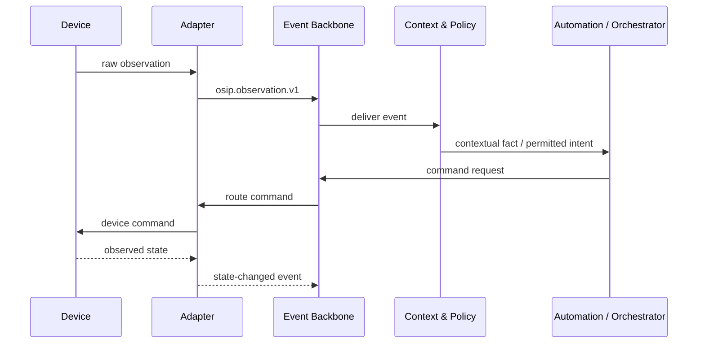

# Architecture Overview

## Scope

OSIP is a set of independently replaceable capabilities that turn physical signals and user intent into safe, observable outcomes. This document defines the logical boundaries. It does not select a final implementation for every boundary.

The reference architecture is local-first: the edge environment owns critical device control, automation, spatial context needed for local behaviour, and the event backbone. Cloud services and external AI enhance explicitly permitted experiences but cannot be required for baseline operation.

## System context

The C4 source remains versioned in `diagrams/c4-system-context.puml` at the repository root; MkDocs generates the following SVG during every build. It deliberately represents Home Assistant, MQTT, Zigbee2MQTT, and cloud/model providers as replaceable external systems rather than OSIP's core.

The companion C4 container view is generated from `diagrams/c4-container-view.puml`.

## Logical layers

| Layer | Responsibilities | Must not own |
| --- | --- | --- |
| Physical and device | Sensors, actuators, robots, engineering equipment, local manual controls. | Platform-specific interpretation or vendor-neutral policy. |
| Connectivity and adapters | Protocol translation, device discovery, normalisation, health, and capability mapping. | The platform domain model or cross-system automation decisions. |
| Event and integration | Contracted event transport, command routing, state projection, retry and observability. | Hidden device-specific semantics. |
| Core domain | Identities, spaces, devices, capabilities, context, tasks, policy, and automation intents. | A dependency on a particular broker, UI, cloud, or LLM. |
| Spatial and context | Digital twin relationships, zone semantics, occupancy/activity evidence, temporal and confidence-aware context. | Raw vendor protocol details. |
| Experience and orchestration | User interaction, automation, notifications, task coordination, and approved AI assistance. | Direct privileged control that bypasses policy and audit. |
| Cloud enhancement | Remote access, opt-in backup, analytics, fleet operations, and approved high-capacity inference. | Single control of critical local functions. |

## Runtime paths

A normal path starts with an observation, such as a sensor measurement or a user command. An adapter normalises it; the backbone distributes a versioned event; the domain/context layer relates it to a space, state, or task; policy and automation choose an allowed action; a command is dispatched through an adapter; and the resulting state is observed and audited.

The command is not assumed successful until an authoritative acknowledgment or observed state establishes it. Timeouts, duplicates, and partially connected devices are normal operational cases.

## Architectural invariants

- The core domain does not import vendor-specific identifiers as its primary identity.
- A cloud or AI service does not receive privileged control merely because it can recommend an action.
- Safety-relevant actions pass through explicit policy, authorization, audit, and manual-override rules.
- Events remain useful to independently developed consumers through documented contracts and versioning.
- Every automation path has enough telemetry to reconstruct what happened and why.

## Related specifications

- [Event Model](event-model.md)
- [Message Bus](message-bus.md)
- [Digital Twin](digital-twin.md)
- [Security Architecture](security-architecture.md)
