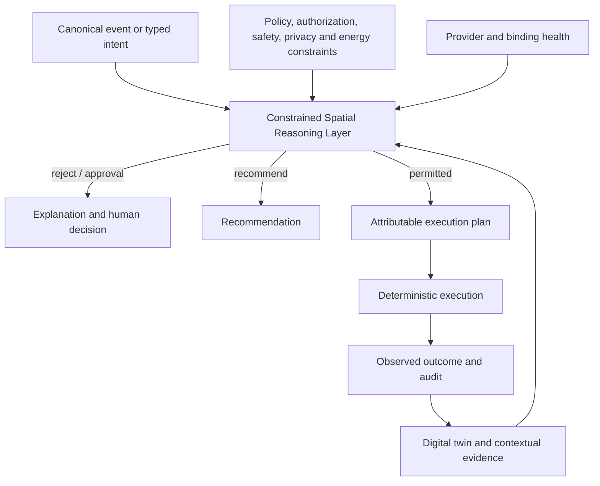

# Constrained Spatial Reasoning Layer

## Purpose

The **Constrained Spatial Reasoning Layer** (CSRL) is the OSIP capability that turns a canonical observation or typed intent into an explainable, policy-bounded decision for a physical space. It is deliberately not an “automation layer”: simple trigger-to-command rules are useful execution tools, but they do not by themselves understand spatial meaning, actor authority, safety, privacy, energy constraints, or the quality of current evidence.

CSRL is the product boundary that distinguishes OSIP from a collection of device automations. Integration providers connect the physical world; deterministic execution carries out approved commands; CSRL decides whether a requested outcome is permissible and how it may be achieved in the current spatial context.

## Inputs and outcomes

The layer evaluates only canonical, attributable inputs:

| Input | Required interpretation |
| --- | --- |
| Canonical event | Associate the observation with a site, space, asset, capability, source, freshness, quality, and provenance. |
| Typed intent | Identify requested outcome, scope, actor, time boundary, constraints, and approval expectation. |
| Digital twin and context | Resolve containment, semantic zones, relationships, desired/current state, occupancy or activity evidence, and provider/binding health. |
| Constraints | Evaluate authorization, policy, safety, privacy, energy, accessibility, operational mode, and manual-override state. |

It produces exactly one attributable result:

- a rejection or request for human approval, with a reason;
- a recommendation that requires an explicit actor decision; or
- an execution plan that names selected assets, capabilities, bindings, constraints, verification evidence, fallback conditions, and expiry.

## Boundaries

CSRL owns cross-cutting reasoning over the space and the declared constraints. It does not own protocol translation, raw telemetry ingestion, direct actuator authority, identity issuance, or a second copy of policy.

| Component | Relationship to CSRL |
| --- | --- |
| Integration provider | Supplies canonical facts and performs provider-specific commands after an approved plan; never decides the general outcome. |
| Digital twin | Supplies state and relationships; does not grant permission or issue commands. |
| Policy engine | Supplies authoritative constraints and decisions; CSRL must not override it. |
| Deterministic execution | Executes approved plans, local rules, schedules, and hard safety behaviour; it does not reinterpret a consequential goal. |
| AI capability | May propose an intent, interpretation, or ranked recommendation; its output is evaluated as input, not accepted as authority. |
| Application/UI | States an outcome or shows an explanation; it does not bypass the Layer with a provider command. |

## Reasoning constraints

“Constrained” is essential. The Layer does not infer facts or authority beyond its evidence. It must respect:

- spatial scope and explicitly modelled relationships;
- freshness, confidence, provenance, and conflicts of context evidence;
- the actor’s role, authorization scope, consent, and approval requirement;
- safety interlocks, manual override, accessibility, energy, and operating-mode policy;
- provider/binding health, command authority, and completion evidence; and
- local-first classification: an `edge-required` outcome has a local, deterministic path that does not require AI, cloud, control plane, or Home Assistant.

When the evidence is stale, contradictory, insufficient, or policy requires a person, the correct result is no action, a safe fallback, or a request for approval—not a confident guess.

## Deterministic automation

Deterministic automation is retained, but its scope is explicit. It may execute a previously accepted plan, apply a schedule, maintain a hard local safety limit, or handle a narrowly defined technical trigger. For consequential action it receives the CSRL decision and records command dispatch, verification, failure, and fallback evidence. It does not silently become an alternative decision layer with different policy semantics.

This allows a Home Assistant automation to remain useful for non-critical provider-local convenience while OSIP keeps portable reasoning, policy, audit, and spatial semantics above providers.

## Explainability and audit

For every consequential decision, CSRL records the canonical input references; digital-twin/configuration/policy versions; relevant spatial relationships and evidence quality; actor and authorization result; constraints considered; selected assets, bindings, and verification criteria; decision/rejection; and observed outcome. A person must be able to answer: *what happened, where, why was it allowed or denied, what path was selected, and did it actually succeed?*

## Reference deployment evidence

The Reference Apartment must validate one CSRL workflow without AI. A suitable workflow begins with a spatial observation or an intent such as preparing a room for a meeting; resolves the room, available capabilities, occupant/access context, and applicable constraints; produces an explainable plan; executes locally; verifies the result; and remains safe during WAN and Home Assistant loss.

## Related documents

- [Intent, Policy, and Execution](intent-policy-and-execution.md)
- [Digital Twin](digital-twin.md)
- [Edge Runtime](edge-runtime.md)
- [AI Architecture](../ai/ai-architecture.md)
- ADR-0013 — Constrained Spatial Reasoning Layer
