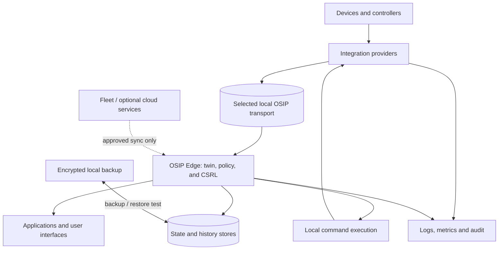

# Deployment Architecture

## Purpose

OSIP deploys essential services in the trusted local environment. This architecture defines service placement and failure boundaries without prescribing one host, database, container runtime, or cloud vendor.

## Local runtime baseline

The initial reference deployment separates the following responsibilities: network and time services; integration providers; the selected local OSIP transport; OSIP Edge, digital twin, policy, Constrained Spatial Reasoning Layer, and deterministic execution services; state and history stores; application/UI integration; observability; and backup/recovery tooling. Services may share a suitably sized local host in the reference apartment, but their identities, storage, credentials, health checks, and restoration procedures remain independent.

## Availability and recovery

WAN loss must not interrupt declared local-first capabilities. Loss of a single integration, store, or host is visible through health signals and must produce a documented degraded state. Backup scope includes service configuration, secret recovery procedure, integration/coordinator recovery material, and data required for the declared recovery objective; a backup is incomplete until restore is tested.

## Deployment constraints

- Runtime definitions and non-secret configuration are versioned with reviewable change history.
- Secrets, personal data, coordinator backups, and production credentials are external to Git.
- Updates have a compatibility check, rollback decision, maintenance window where appropriate, and post-update health evidence.
- Cloud egress is explicit, minimal, classified, and does not silently become a local control dependency.

## Related documents

- [Architecture Overview](architecture-overview.md)
- [Security Architecture](security-architecture.md)
- [Operations](../operations/README.md)
