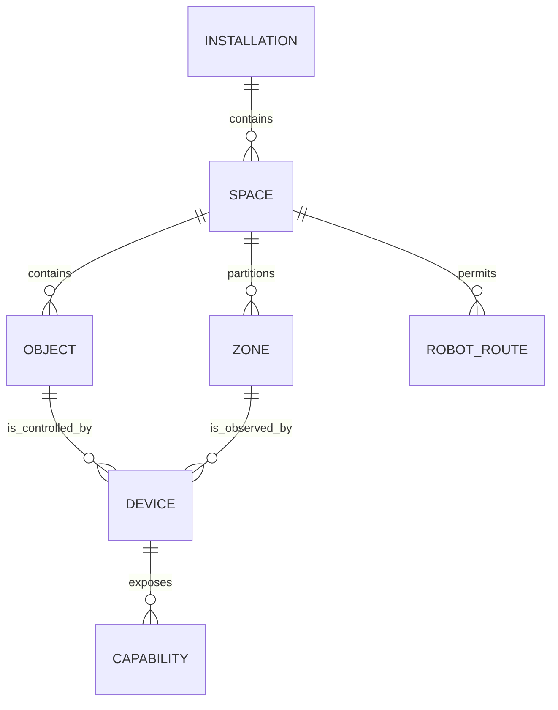

# Digital Twin

## Purpose

The digital twin is OSIP's structured representation of the installation and its meaningful spatial relationships. It enables people and services to refer to “the reading area,” “the window beside the desk,” or “the robot's charging location” without leaking device-vendor identifiers into the platform model.

## Model layers

| Layer | Examples | Authority and change method |
| --- | --- | --- |
| Physical baseline | Building, floor, room boundaries, doors, fixed engineering assets, coordinate reference. | Curated during design/commissioning; changes are reviewed configuration changes. |
| Semantic model | Room purposes, zones, named objects, accessibility, safety areas. | Owned by the installation and versioned as configuration. |
| Asset linkage | Device-to-location, actuator-to-object, sensor field of view, robot docks. | Commissioning record with identity and verification evidence. |
| Live state | Temperature, position, occupancy evidence, door status, robot mission state. | Observed from adapters; timestamped and source-attributed. |
| Derived context | “reading zone active”, inferred occupancy, recommended task. | Derived, confidence- and freshness-qualified; never overwrites physical facts. |

## Identity and relationships

Every twin entity has a stable OSIP identity, type, owning installation, lifecycle state, and provenance. Vendor identifiers remain adapter attributes. Relationships are typed and directional where useful: `contains`, `adjacent-to`, `located-in`, `covers`, `controls`, `observes`, `serves`, and `reachable-from`.

## Reconciliation rules

Physical and semantic changes are declared configuration changes and are reviewed before they become authoritative. Live state is append-only observational evidence; it is not a way to redefine a room or device location. Derived context expires according to its source freshness and confidence rules. A conflict is surfaced to an operator when multiple sources disagree or when a change would affect safety, access, or automation scope.

The first implementation may use a modest set of rooms and zones. The identity, relationship, provenance, and change rules are introduced from the start so the model can grow into CAD/BIM imports, robotics, or richer visualization without a disruptive migration.
