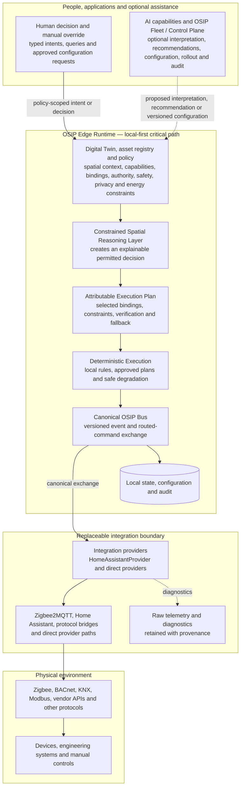

# End-to-End Operating Model

## Purpose

This view explains how OSIP operates a physical space end to end. It complements the C4 diagrams: C4 identifies systems and containers, while this diagram shows the canonical information and control path. The central distinction is that integration technology connects OSIP to the physical environment, but the **Constrained Spatial Reasoning Layer** decides what may happen in a space under explicit constraints.

## Reading the diagram

1. Devices and engineering systems communicate through their native protocols. Zigbee2MQTT and Home Assistant are useful integration paths, not OSIP domain dependencies.
2. Providers validate the asset binding and convert external data into canonical OSIP events. Raw telemetry remains separately retained for diagnosis and reprocessing.
3. The local OSIP bus distributes canonical facts. The digital twin attaches spatial meaning, relationships, freshness, provenance, and health.
4. CSRL evaluates the requested outcome or observed situation against the twin, policy, actor authority, and evidence quality. Its result is an explanation, recommendation, denial, approval request, or execution plan.
5. Deterministic execution carries out only the permitted plan through an eligible provider, verifies the observed result, and records audit evidence.
6. Fleet/control plane and AI may improve operation, but neither is synchronously required for a declared local critical path. AI proposes an interpretation or intent; it never commands an actuator directly.

## Local continuity rule

The solid route through OSIP Edge is the declared local-first path. For an `edge-required` capability it must remain operational during WAN loss and without an AI service, control plane, or Home Assistant dependency. Dashed links are optional enhancement, configuration synchronisation, or recommendation paths.

## Related documents

- [Architecture Overview](architecture-overview.md)
- [Integration Providers](integration-providers.md)
- [Constrained Spatial Reasoning Layer](constrained-spatial-reasoning-layer.md)
- [Edge Runtime](edge-runtime.md)
- [Fleet and Control Plane](fleet-control-plane.md)
