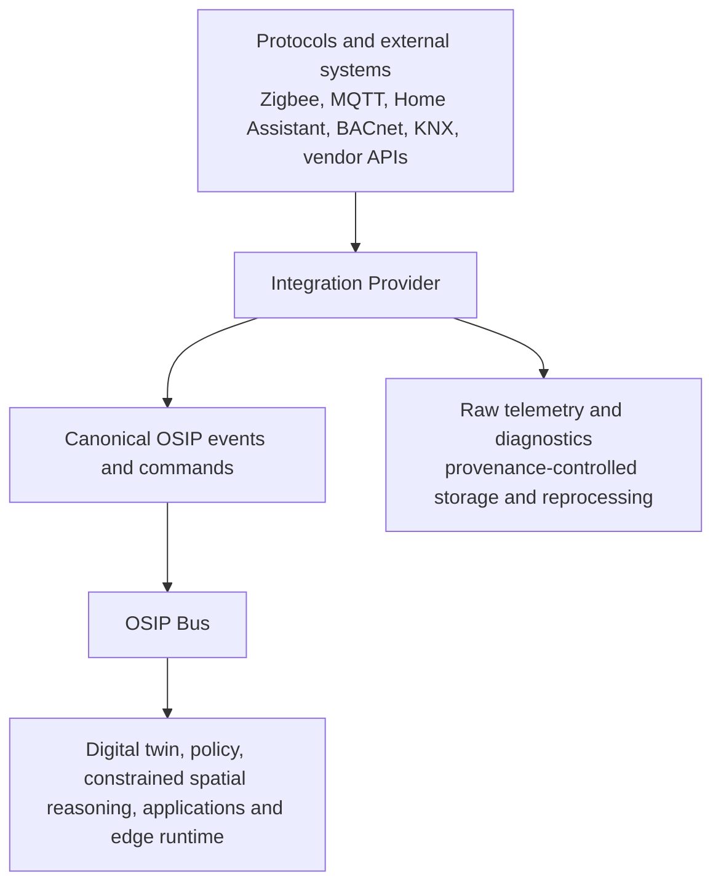

# Integration Providers and the Canonical Boundary

## Purpose

An integration provider is a bounded component that translates one external product, protocol, or API into OSIP assets, capabilities, canonical events, canonical commands, health, and diagnostics. It lets OSIP reuse mature ecosystems without importing their identity, lifecycle, security, or data model into the OSIP core.

Home Assistant is a first-class candidate provider for the MVP because it offers discovery, local communication, dashboards, scenes, and a broad integration ecosystem. It is not an OSIP foundation or a mandatory path. Direct BACnet, KNX, Modbus, MQTT, Zigbee2MQTT, and vendor providers may be added when a concrete deployment proves a fidelity, latency, reliability, or product need.

## Canonical boundary

Everything north of this boundary uses OSIP asset identity, capability contracts, canonical event names, and policy-scoped commands. It must not inspect raw MQTT topics, Home Assistant `entity_id`s, BACnet objects, or a vendor payload to make domain decisions. The transport is therefore below the semantic boundary, not the thing that unifies the platform.

## Provider responsibilities

1. Discover or receive external endpoints and represent them as candidate bindings.
2. Map units, timestamps, health, identities, and provider semantics into an explicit capability contract.
3. Validate an endpoint against the commissioned asset/binding before publishing a canonical event.
4. Preserve raw telemetry and diagnostic references with provider provenance and access controls.
5. Translate an authorized canonical command into a provider-specific request and report acceptance, failure, timeout, and observed completion separately.
6. Report provider and binding health, supported-version information, limits, and degraded modes.

Providers do not own an OSIP site’s authoritative space graph, general policy, intent semantics, or cross-provider spatial reasoning. They also do not receive broad administrative broker or API permissions merely because they handle integrations.

## HomeAssistantProvider

`HomeAssistantProvider` maps a registered Home Assistant instance into candidate OSIP bindings. It may use Home Assistant for discovery, non-critical local automation, dashboard convenience, and broad protocol coverage. It maps HA entities into OSIP capability contracts and emits canonical events only after asset/binding validation.

The provider cannot make an HA entity the `asset_id`, rely on HA availability for a declared critical loop, or expose raw entities as a general OSIP application API. If HA does not expose necessary detail, creates unacceptable latency, loses a required protocol semantic, or is an unacceptable point of failure, a direct provider can coexist with it for the same asset.

## Direct providers and addition criteria

A direct provider is not written simply because a protocol exists. It is proposed when reference-deployment evidence shows at least one of the following: required information is unavailable through an existing provider; protocol-specific capability must be exposed; latency or availability is inadequate; a critical control path must remain independent; or OSIP needs explicit lifecycle/control ownership. The proposal records the capability delta, security boundary, operating burden, test fixtures, rollback path, and why the existing provider is insufficient.

## Raw telemetry and reprocessing

Canonical events carry the normalized facts needed by domain consumers. Raw telemetry is retained separately for diagnostics, device health, audit, and later reprocessing. It has a provider reference, source timestamp, receipt timestamp, schema/version when known, integrity status, classification, and retention policy. Raw data is not silently republished onto a broad OSIP domain topic and must not leak into an AI or application context without an approved purpose.

## Command outcome model

Provider receipt is not physical completion. A provider records a command lifecycle such as `requested`, `accepted-for-dispatch`, `rejected`, `timed-out`, `observed-complete`, or `observed-divergent`. The execution plan determines what evidence is sufficient for a capability and when a fallback or human escalation is safe.

## Related documents

- [Physical Asset Model](physical-asset-model.md)
- [Event Model](event-model.md)
- [Message Bus](message-bus.md)
- [Edge Runtime](edge-runtime.md)
- [Zigbee Mesh and MQTT Bridge](zigbee-mesh-and-mqtt-bridge.md)
