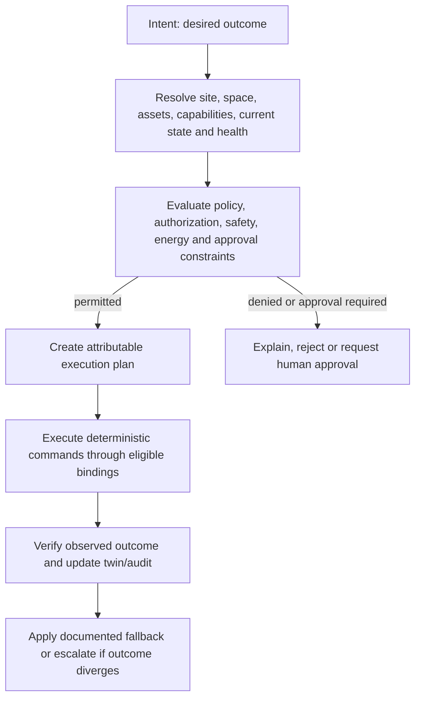

# Intent, Policy, and Execution

## Purpose

OSIP distinguishes the outcome a user or application requests from the individual commands required to reach it. This allows a space to be operated through its physical model and available capabilities rather than through a fixed list of integration-specific devices. It also prevents convenience features, AI, or applications from bypassing safety, access, energy, and operational constraints.

## Distinct responsibilities

| Concern | Owns | Must not own |
| --- | --- | --- |
| Digital twin | Current/desired state, relationships, provenance, freshness, and provider health. | Permission or execution authority. |
| Policy engine | What is permitted, mandatory, prohibited, or approval-gated. | Raw protocol translation or undisclosed automation side effects. |
| Constrained Spatial Reasoning Layer | Eligible capabilities, bindings, spatial/context evidence, constraints, fallbacks, and an explainable proposed execution plan. | The final authority to ignore policy, direct actuator authority, or protocol translation. |
| Deterministic execution | Narrow triggers, schedules, hard local rules, accepted-plan execution, and command verification. | A hidden second policy model or independent interpretation of consequential goals. |
| Integration provider | Translation to/from an external system. | General business intent or cross-provider state. |

## Intent lifecycle

An intent may be as specific as “prepare Room 204 for Meeting Mode” or as constrained as “maintain comfort during a booked meeting within energy and access policy.” It names an outcome, scope, actor, time boundary, constraints, and optionally an approval expectation. It does not name arbitrary low-level commands unless the caller is authorized to request a specific capability action.

## Execution plans

An execution plan is a durable, attributable decision record produced by the Constrained Spatial Reasoning Layer for one accepted intent. It identifies the twin/configuration versions used, selected assets and capabilities, provider bindings, expected state changes, policy decisions, correlation IDs, fallback conditions, verification evidence, and expiry. A plan can be re-evaluated when provider health, policy, occupancy, access state, or other material facts change.

Plans select a primary and, where necessary, fallback binding explicitly. For example, a BACnet binding can provide primary HVAC control while a Home Assistant binding provides observability and UI convenience. A fallback cannot be activated simply because it is available; policy declares the safety and authority conditions.

## Deterministic and safety-relevant execution

Critical actions remain local, deterministic, and independently executable by the OSIP Edge runtime. An emergency shutoff, access restriction, leak response, or configured HVAC limit must not depend on cloud access, AI availability, a central fleet service, or Home Assistant. The execution engine must retain the local policy, relevant asset/binding configuration, authorization scope, desired state, and conservative failure behaviour needed for its declared operation.

## AI and human control

AI may interpret natural language, suggest an intent, rank alternatives, explain a plan, or identify anomalies. Its output is an intent or recommendation, never a privileged actuator command. Policy validation, authorization, audit, deterministic execution, manual override, and outcome verification remain separate. Human interfaces explain the requested outcome, the policy result, selected control path, and observed result for consequential actions.

## Related documents

- [Physical Asset Model](physical-asset-model.md)
- [Digital Twin](digital-twin.md)
- [Constrained Spatial Reasoning Layer](constrained-spatial-reasoning-layer.md)
- [Edge Runtime](edge-runtime.md)
- [AI Architecture](../ai/ai-architecture.md)
- [Security Architecture](security-architecture.md)
