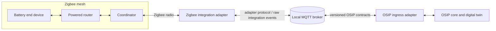

# Zigbee Mesh and MQTT Bridge

## Purpose

This specification defines the boundary between a Zigbee device network and OSIP's local event backbone. It prevents a common but consequential confusion: **Zigbee Mesh and MQTT are not competing meshes and are not the same layer.**

Zigbee is a low-power IEEE 802.15.4 device network. Its mesh carries radio traffic between devices and a coordinator. MQTT is OSIP's initial local application-message transport: clients publish to, and subscribe from, a broker. MQTT may run over Ethernet or Wi-Fi, but OSIP does not describe it as a mesh.

## Architectural position

The Zigbee network belongs to the physical-device integration layer. An integration adapter exposes its observations and accepted commands to the OSIP message bus. The adapter may initially be Zigbee2MQTT; Home Assistant ZHA, a commercial gateway, or another implementation may replace it if it preserves the OSIP integration contract.

The lower radio boundary and the upper OSIP contract boundary have separate failure modes, identities, security controls, and delivery semantics. They must be monitored separately.

## Zigbee network roles

| Role | OSIP interpretation | Operational expectation |
| --- | --- | --- |
| Coordinator | The one radio network root connected to the integration adapter. | Its backup, firmware compatibility, channel, PAN settings, and network key are commissioning assets. It is not an OSIP domain service. |
| Router | Usually a permanently powered Zigbee device that can relay packets. | Place intentionally to provide coverage and redundant paths; its availability affects neighbouring battery devices. |
| End device | Usually a battery-powered sensor, button, lock, or actuator that does not relay traffic. | Do not use it to extend coverage. Sleep, polling, and battery depletion can make it temporarily unavailable without indicating an OSIP software failure. |

The exact role, radio capability, and manufacturer behaviour are discovered facts, not assumptions derived from a product category. A mains-powered device is not automatically a useful router, and a device that claims routing capability must still be validated in the reference installation.

## Topology and installation rules

Mesh quality is designed before automation logic is tuned. The reference-apartment installation must record coordinator location, radio channel, router locations, powered-device dependencies, known RF obstacles, and an acceptance walk-through of every intended device location.

The preferred rollout sequence is:

1. Select a coordinator location with suitable USB, power, host, and radio separation from sources of interference.
2. Install and stabilise the powered routers nearest to the coordinator and along the intended coverage paths.
3. Join battery end devices only after the router foundation is healthy.
4. Verify command latency, reporting, route recovery after a router restart, and recovery after an adapter restart.
5. Record the validated topology and device inventory in the reference design and installer evidence.

Adding or moving powered devices can change available routes. A commissioning change is therefore an operational change: test the affected area and update the installation record instead of assuming that pairing success proves reliable coverage.

## Identity and state mapping

Radio identifiers do not become OSIP identifiers unchanged. An adapter may observe an IEEE/EUI-64 address, a mutable short network address, a manufacturer/model pair, endpoint and cluster identifiers, plus a user-assigned friendly name. OSIP maintains a stable `device_id` and relates it to those integration identifiers in a controlled mapping.

Short network addresses and friendly names are integration attributes; they may change after rejoin, replacement, or recommissioning. The mapping records source, first-seen and last-seen times, and lifecycle status. Replacing a physical device requires an explicit installer or administrator workflow, rather than silently assigning the replacement the former device's identity.

The digital twin consumes normalized capabilities and state, for example `occupancy`, `illuminance`, `switch`, `level`, or `contact`. It retains source, observation time, quality, and connectivity information. Raw clusters, vendor extensions, and adapter-specific payloads remain available for diagnosis but do not leak into general automation contracts.

## Event and command flow

An observation travels from a device over the Zigbee mesh to the coordinator, then through the adapter and MQTT integration boundary. The OSIP ingress adapter validates the source, maps integration identity to `device_id`, normalizes the payload, and publishes a versioned OSIP event. A command follows the inverse path and its outcome is observed separately; acceptance by MQTT is not proof that a Zigbee actuator completed the action.

For each supported capability, the integration contract must specify:

- the normalized command and event schema and version;
- correlation and idempotency keys;
- the intended MQTT QoS and whether retained state is appropriate;
- a timeout and the observable evidence of completion;
- how unavailable, stale, malformed, and unsupported states are represented; and
- the raw diagnostic reference needed to investigate translation failures.

Zigbee retries and MQTT QoS solve different portions of delivery. Either layer can duplicate, delay, or fail a message. OSIP command handlers and state projections must therefore be idempotent and time-aware. Retained MQTT data is a convenience for a state projection, never proof that a sleeping device is currently reachable.

## Trust boundaries and secrets

The Zigbee network key, coordinator backup, adapter credentials, broker credentials, and OSIP service credentials are distinct secrets. None belong in Git or in a diagram. Access from the adapter to MQTT is restricted to the integration topics it needs; the OSIP ingress adapter gets separate credentials for publishing normalized contracts. General OSIP services do not gain unrestricted access to the adapter's raw control topics.

The coordinator host and adapter are part of the local trusted environment. Their availability, adapter health, broker authorization failures, device last-seen times, route-related symptoms, and battery signals are observable operational signals. Loss of cloud connectivity must not prevent local Zigbee control through the local path.

## Vendor and technology independence

OSIP does not require every device to use Zigbee and does not make its domain model dependent on Zigbee clusters. Matter, Thread, ESPHome, wired buses, or vendor gateways can expose the same OSIP capability contracts through their own adapters. Zigbee remains a strong initial choice for low-power local devices where the reference design validates its radio and operational constraints.

Likewise, Zigbee2MQTT is not the OSIP core. It is valuable because it can bridge a broad Zigbee ecosystem into a local MQTT environment, but its raw topic taxonomy and naming conventions are an adapter concern. Replacing it is acceptable only after compatibility, commissioning, security, and observability requirements have been tested.

## Consequences for the reference apartment

The reference apartment must treat the Zigbee mesh as a documented subsystem, not an invisible transport. The reference design will include a radio topology drawing, coordinator and router placement rationale, integration inventory, normalized capability matrix, commissioning checklist, and failure-recovery test record. These artefacts later become inputs to the Installer Edition.

## Related specifications

- [Architecture Overview](architecture-overview.md)
- [Device Model](device-model.md)
- [Event Model](event-model.md)
- [Message Bus](message-bus.md)
- [Digital Twin](digital-twin.md)
- [Security Architecture](security-architecture.md)
