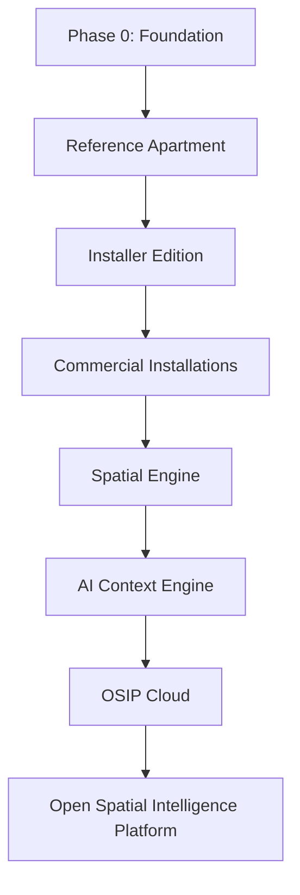

# Roadmap

## Planning rule

The roadmap is capability-led rather than date-led. Dates become commitments only after dependencies, owners, acceptance evidence, and operating constraints are known. A phase may overlap discovery for the next phase, but it cannot declare success by producing documents or prototypes alone.

## Phases and exit criteria

### Phase 0 — Foundation

Establish the Charter, principles, documentation workflow, ADR set, architecture overview, core model direction, security baseline, and technology evaluation approach. Exit when the reference-apartment design can make constrained decisions without contradicting the baseline.

### Reference Apartment

Build and operate the 165 m² laboratory as a documented system. Exit when core local control, event flow, commissioning evidence, operational monitoring, and failure recovery are demonstrated under realistic conditions.

### Installer Edition

Package the supported reference patterns into repeatable commissioning and support workflows. Exit when a trained installer can deliver a bounded deployment without relying on undocumented founder knowledge.

### Commercial Installations

Validate delivery, support, pricing, partner, and lifecycle assumptions across customer installations. Exit when the platform interfaces and support patterns are demonstrably reusable.

### Platform capabilities

Spatial Engine, AI Context Engine, and OSIP Cloud evolve from proven needs. Each must preserve the local-first baseline, have versioned contracts, and provide measurable value beyond device-level automation.
