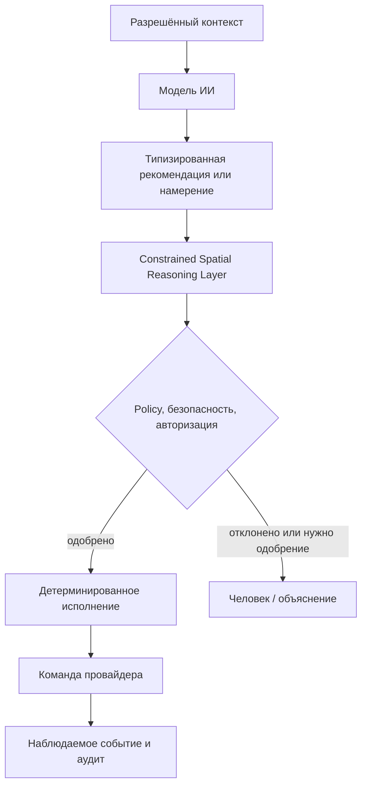

# Архитектура ИИ

## Роль

ИИ - нативная возможность OSIP для интерпретации разрешённого контекста, объяснения среды, рекомендации действий, помощи инсталлятору, обнаружения аномалий и, в перспективе, координации задач. Он не является источником полномочий в вопросах безопасности или контроля доступа и не может обходить детерминированные политика, авторизацию, аудит или ручное управление.

## Режимы исполнения

| Режим | Подходящая работа | Граница |
| --- | --- | --- |
| Приватный локальный inference | Чувствительный контекст, низкая задержка, офлайн-использование и ограниченные языковые модели. | Работает на OSIP Edge или на выделенном доверенном AI host локальной сети; без egress по умолчанию и без полномочий на управление. |
| Облачный inference | Необязательное высокопроизводительное рассуждение, анализ и улучшение. | Требует явной классификации данных, согласия, egress-policy и полезного локального деградированного режима. |
| Constrained Spatial Reasoning Layer | Пространственная/контекстная интерпретация, разрешение намерений в рамках политик, объяснимые рекомендации и планы исполнения. | Не требует модели ИИ; вывод AI — только вход этого слоя. |
| Детерминированное исполнение | Правила безопасности, базовый комфорт, исполнение принятого плана, валидация команд и жёсткие ограничения. | Не требует модели ИИ и остаётся авторитетным при отказе модели или WAN. |

## Контролируемый путь действия

ИИ-компонент получает только контекст и инструменты, разрешённые для его роли. Вызов инструмента превращается в типизированное намерение или рекомендацию, которые Constrained Spatial Reasoning Layer оценивает по доказательствам цифрового двойника, политикам и авторизации до выдачи команды детерминированным исполнением. Система фиксирует входную ссылку, версию модели или инструмента, предложенное намерение, результат CSRL/политики, актора и наблюдаемый результат. Секреты, неограниченный доступ к брокеру и необработанные административные команды никогда не являются инструментами модели.

## Память, конфиденциальность и оценка

Память ИИ разделена на неизменные факты инсталляции из digital twin, текущее состояние из утверждённых проекций, пользовательские предпочтения с владельцем и сроком хранения и производную рабочую память со сроком истечения. Для каждого хранилища определяются классификация данных и возможность их выхода за границу инсталляции.

Каждая функция ИИ начинается с пользовательской или инсталляторской задачи, non-AI fallback, тестов приёмки, анализа вредных действий и ожидаемого объяснения. Оцениваются полезность, частота ошибок, корректность отказов, соблюдение конфиденциальности, задержка, стоимость и возможность реконструировать значимые рекомендации. Выбор модели является решением реализации и не должен переопределять доменные контракты OSIP.

Решение о маршрутизации модели ограничено политикой: приватный запрос никогда не отправляется в cloud model молча. Принятые профили развёртывания и evidence выбора описаны в [Стратегии развёртывания моделей ИИ](ai-model-deployment-strategy.md).
