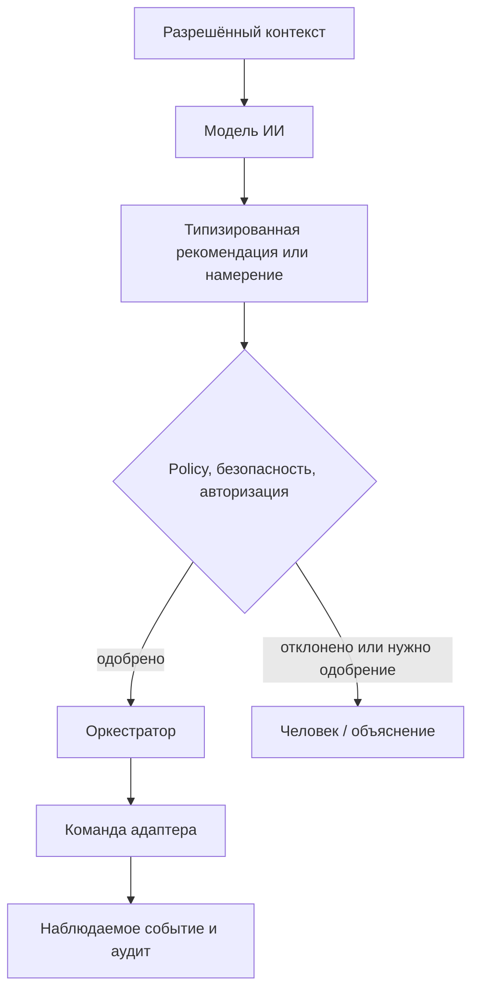

# Архитектура ИИ

## Роль

ИИ - нативная capability OSIP для интерпретации разрешённого контекста, объяснения среды, рекомендации действий, помощи инсталлятору, обнаружения аномалий и, в перспективе, координации задач. Он не является источником полномочий в вопросах безопасности или контроля доступа и не может обходить детерминированные policy, авторизацию, аудит или ручное управление.

## Режимы исполнения

| Режим | Подходящая работа | Граница |
| --- | --- | --- |
| Локальный inference | Чувствительный контекст, низкая задержка, офлайн-использование, ограниченные модели. | Работает внутри доверенной границы инсталляции и ограничен ресурсами. |
| Облачный inference | Необязательное высокопроизводительное рассуждение, анализ и улучшение. | Требует явной классификации данных, согласия, egress-policy и полезного локального деградированного режима. |
| Детерминированная автоматика | Правила безопасности, базовый комфорт, валидация команд, жёсткие ограничения. | Не требует модели ИИ и остаётся авторитетной при отказе модели или WAN. |

## Контролируемый путь действия

ИИ-компонент получает только контекст и инструменты, разрешённые для его роли. Вызов инструмента превращается в типизированное намерение, которое policy и авторизация оценивают до выдачи команды оркестратором. Система фиксирует входную ссылку, версию модели или инструмента, предложенное намерение, результат policy, актора и наблюдаемый результат. Секреты, неограниченный доступ к брокеру и необработанные административные команды никогда не являются инструментами модели.

## Память, конфиденциальность и оценка

Память ИИ разделена на неизменные факты инсталляции из digital twin, текущее состояние из утверждённых проекций, пользовательские предпочтения с владельцем и сроком хранения и производную рабочую память со сроком истечения. Для каждого хранилища определяются классификация данных и возможность их выхода за границу инсталляции.

Каждая функция ИИ начинается с пользовательской или инсталляторской задачи, non-AI fallback, тестов приёмки, анализа вредных действий и ожидаемого объяснения. Оцениваются полезность, частота ошибок, корректность отказов, соблюдение конфиденциальности, задержка, стоимость и возможность реконструировать значимые рекомендации. Выбор модели является решением реализации и не должен переопределять доменные контракты OSIP.
