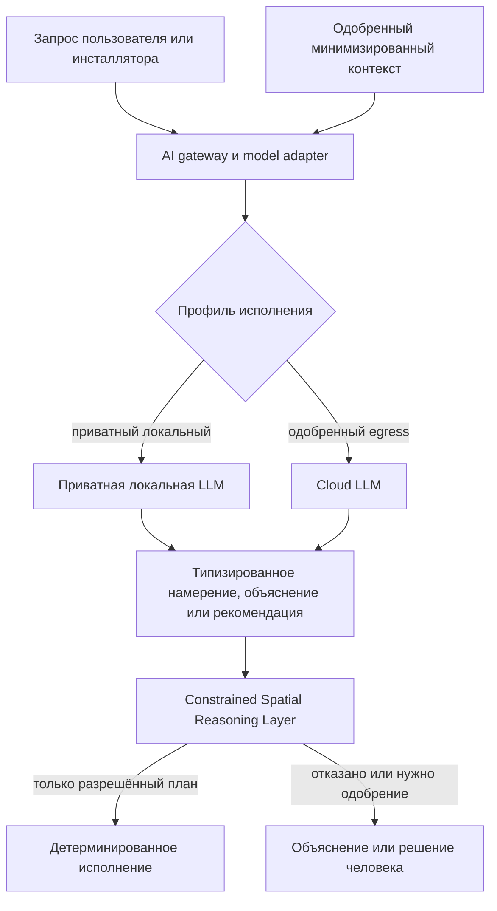

# Стратегия развёртывания моделей ИИ

## Назначение

OSIP поддерживает AI, не делая конкретную модель, вендора или cloud service частью архитектуры платформы. Эта стратегия определяет поддерживаемые профили исполнения языковых моделей и других inference-сервисов. Она сохраняет три обязательных свойства: приватный вариант для чувствительных сред, необязательное использование более мощных cloud models при оправданной необходимости и детерминированный путь без AI для критической работы.

Названия моделей намеренно не выбираются в этом документе. Локально развёртываемая модель — например, будущая модель семейства GLM — может подойти, как и другая модель, только после соответствия критериям оценки, лицензии, конфиденциальности, эксплуатации и hardware из этого документа.

## Профили исполнения

| Профиль | Размещение | Подходящая работа | Граница |
| --- | --- | --- | --- |
| Базовый режим без модели | Только OSIP Edge | Критическое управление, безопасность, проверка политик, детерминированное исполнение и все объявленные функции `edge-required`. | Всегда доступен; не вызывает модель AI. |
| Приватная локальная LLM | OSIP Edge, если позволяют ресурсы, либо выделенный доверенный сервер в локальной сети заказчика. | Приватное взаимодействие на естественном языке, объяснения, помощь инсталлятору, ограниченная интерпретация намерений и локальный поиск знаний. | По умолчанию без egress; сервис модели получает только одобренный контекст и остаётся необязательным. |
| Одобренная cloud model | Явно одобренный внешний AI service. | Высокопроизводительный анализ, сложная языковая работа, необязательное улучшение модели или задачи сверх возможностей локального hardware. | Требует классификации данных, согласия, когда оно применимо, явного egress, соглашения с провайдером и полезного non-cloud fallback. |

Приватная локальная LLM не обязана работать на том же небольшом устройстве, которое выполняет radio integration или критическое управление. Развёртывание может использовать resource-constrained Edge runtime для детерминированных функций и отдельный AI host в локальной сети для необязательного inference. Потеря AI host — наблюдаемый деградированный режим, а не потеря управления.

## Обязательная граница модели

Каждая модель вызывается через OSIP AI model adapter. Adapter идентифицирует модель/версию и профиль исполнения; применяет authentication, limits по частоте, стоимости и контексту; фиксирует атрибутируемые request/response metadata; и предоставляет только одобренные типизированные операции. Он не выдаёт broker administration, raw commands актуаторам, неограниченный доступ к базе данных или неограниченную исходную telemetry.

Для каждой операции модели предпочтителен structured output: versioned intent, recommendation, explanation или retrieval result, валидируемый по схеме. Один только текст на естественном языке не является command contract. Это вместе с CSRL и проверкой политик делает результаты более консистентными, чем прямое доверие ответу модели.

## Первые разрешённые роли

Первые интеграции приватных или cloud LLM могут:

- преобразовывать аутентифицированный запрос в типизированное намерение или задавать уточняющий вопрос;
- объяснять наблюдаемое состояние OSIP, план, решение или деградированное состояние;
- помогать инсталлятору находить одобренную документацию и готовить неисполняющие чек-листы ввода в эксплуатацию;
- суммировать diagnostics, уже разрешённые для роли запрашивающего; и
- предлагать рекомендацию или аномалию для проверки CSRL/человеком.

Они не могут обходить политики, интерпретировать неоднозначную речь как полномочие на значимое действие, выдавать команду провайдеру напрямую, определять safety interlocks или включать cloud egress по умолчанию.

## Критерии выбора и приёмки

Кандидатная модель и runtime оцениваются для каждого профиля исполнения. Evidence выбора должны включать:

- поддерживаемые языки и качество для целевой аудитории;
- надёжность schema-constrained типизированного output и безопасную обработку неоднозначности;
- latency, throughput, ёмкость контекста и поведение при одновременном использовании на целевом private hardware;
- требования к памяти, accelerator, питанию, охлаждению, packaging, update, rollback, monitoring и recovery;
- условия лицензии, коммерческие права, provenance модели, update policy и реакцию на уязвимости;
- поведение privacy/data retention, telemetry, network egress, access control и аудит;
- evaluation corpus на основе одобренных intents OSIP, объяснений, случаев отказа и adversarial prompts; и
- детерминированный fallback и процедуру отключения.

Модель не принимается только потому, что формулирует хорошие ответы. Она должна соответствовать критериям безопасности, конфиденциальности, эксплуатации и консистентности заявленной роли в Reference Apartment до включения в профиль Installer Edition.

## Правила маршрутизации

Маршрутизация — решение политики, а не удобство приложения:

1. Предпочитать базовый режим без модели, когда AI capability не нужна.
2. Использовать приватную локальную LLM, когда функция разрешена локально и требуемые качество/стоимость/latency подходят доступному private hardware.
3. Использовать cloud model только когда её дополнительная ценность явна и политика разрешает классифицированному контексту покинуть доверенную среду.
4. Если допустимая модель недоступна, вернуть безопасное объяснение, передать решение человеку или использовать детерминированный workflow. Никогда не переключать приватный запрос на облако молча.

## Связанные документы

- [Архитектура ИИ](ai-architecture.md)
- [Дорожная карта возможностей ИИ](ai-capability-roadmap.md)
- [Слой ограниченного пространственного рассуждения](../architecture/constrained-spatial-reasoning-layer.md)
- [Edge Runtime](../architecture/edge-runtime.md)
- ADR-0007 — AI-Native, Runtime-Optional Operation
