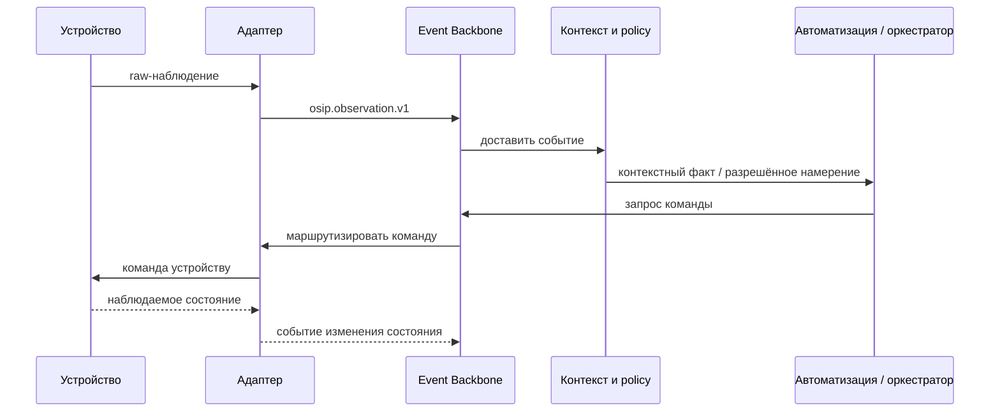

# Обзор архитектуры

## Охват

OSIP — набор независимо заменяемых возможностей, которые преобразуют физические сигналы и намерения пользователя в безопасные и наблюдаемые результаты. Этот документ определяет логические границы, но не выбирает окончательную реализацию для каждой из них.

Эталонная архитектура следует принципу Local First: критическое управление устройствами, автоматизация, необходимый для локального поведения пространственный контекст и event backbone принадлежат edge-среде. Облачные сервисы и внешние ИИ расширяют только явно разрешённые сценарии и не требуются для базовой работы.

## Контекст системы

Исходник C4 хранится в корневом каталоге репозитория `diagrams/c4-system-context.puml`; MkDocs создаёт следующий SVG при каждой сборке. В нём Home Assistant, MQTT, Zigbee2MQTT и облачные/модельные провайдеры намеренно показаны как заменяемые внешние системы, а не ядро OSIP.

Сопутствующий контейнерный вид C4 генерируется из `diagrams/c4-container-view.puml`.

## Логические слои

| Слой | Ответственность | Не должен владеть |
| --- | --- | --- |
| Физический и устройства | Датчики, актуаторы, роботы, инженерное оборудование, локальные ручные органы управления. | Специфичной для платформы интерпретацией или нейтральной к вендору policy. |
| Связность и адаптеры | Трансляция протоколов, обнаружение устройств, нормализация, health и сопоставление capability. | Доменной моделью платформы или межсистемными решениями автоматизации. |
| События и интеграция | Контрактная доставка событий, маршрутизация команд, проекция состояния, повторы и наблюдаемость. | Скрытой семантикой, специфичной для устройства. |
| Основной домен | Identity, пространства, устройства, capability, контекст, задачи, policy и намерения автоматизации. | Зависимостью от конкретного брокера, UI, облака или LLM. |
| Пространство и контекст | Связи digital twin, семантика зон, доказательства присутствия/активности, контекст с учётом времени и уверенности. | Деталями raw-протокола вендора. |
| Взаимодействие и оркестрация | Взаимодействие с пользователем, автоматизация, уведомления, координация задач и разрешённая ИИ-помощь. | Прямым привилегированным управлением в обход policy и аудита. |
| Облачное расширение | Удалённый доступ, backup по согласию, аналитика, операции парка и разрешённый высокопроизводительный inference. | Единоличным управлением критичными локальными функциями. |

## Пути выполнения

Обычный путь начинается с наблюдения — например, измерения датчика или команды пользователя. Адаптер нормализует его; backbone распространяет версионированное событие; доменный/контекстный слой связывает его с пространством, состоянием или задачей; policy и автоматизация выбирают разрешённое действие; команда отправляется через адаптер; итоговое состояние наблюдается и аудируется.

Команда не считается успешной, пока это не подтвердит авторитетное подтверждение или наблюдаемое состояние. Таймауты, дубликаты и частично подключённые устройства — нормальные эксплуатационные случаи.

## Архитектурные инварианты

- Основной домен не использует идентификаторы вендоров как первичную identity.
- Облачный или ИИ-сервис не получает привилегированного контроля только потому, что может рекомендовать действие.
- Значимые для безопасности действия проходят через явные правила policy, авторизацию, аудит и правила ручного override.
- Документированные контракты и версионирование делают события полезными независимым потребителям.
- У каждого пути автоматизации есть telemetry, достаточная для восстановления произошедшего и его причины.

## Связанные спецификации

- [Модель событий](event-model.md)
- [Шина сообщений](message-bus.md)
- [Цифровой двойник](digital-twin.md)
- [Архитектура безопасности](security-architecture.md)
