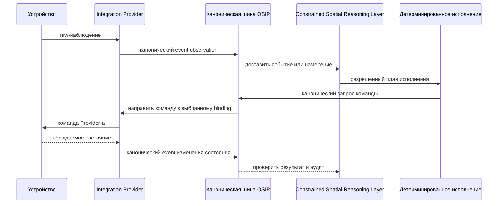

# Обзор архитектуры

## Охват

OSIP — набор независимо заменяемых возможностей, которые преобразуют физические сигналы и намерения пользователя в безопасные и наблюдаемые результаты. Этот документ определяет логические границы, но не выбирает окончательную реализацию для каждой из них.

Эталонная архитектура следует принципу Local First: среда исполнения OSIP Edge владеет объявленным критическим управлением, Constrained Spatial Reasoning Layer, детерминированным исполнением, релевантным пространственным состоянием и состоянием активов, политиками и локальной канонической шиной. Провайдеры интеграций, такие как Home Assistant, Zigbee2MQTT, BACnet, KNX, MQTT-мосты и API производителей, являются заменяемой южной инфраструктурой. Парк и control plane, а также внешние AI services расширяют только явно разрешённые сценарии и не требуются для базовой работы.

## Контекст системы

Исходник C4 хранится в корневом каталоге репозитория `diagrams/c4-system-context.puml`; MkDocs создаёт следующий SVG при каждой сборке. В нём Home Assistant, MQTT, Zigbee2MQTT и облачные/модельные провайдеры намеренно показаны как заменяемые внешние системы, а не ядро OSIP.

Сопутствующий контейнерный вид C4 генерируется из `diagrams/c4-container-view.puml`.

## Логические слои

| Слой | Ответственность | Не должен владеть |
| --- | --- | --- |
| Физическая среда | Объекты, здания, пространства, активы, люди, инженерное оборудование и локальные ручные органы управления. | Идентичностью или политикой, специфичной для провайдера. |
| Провайдеры интеграций | Трансляция протоколов, обнаружение, жизненный цикл привязок, нормализация, работоспособность, исходная диагностика и сопоставление возможностей. | Доменной моделью OSIP, политиками между провайдерами или API приложений. |
| Каноническая шина | Контрактные канонические события и маршрутизированные команды, корреляция, повторы и наблюдаемая доставка. | Скрытой семантикой устройства или требованием, чтобы каждое устройство использовало один транспорт. |
| Constrained Spatial Reasoning Layer | Пространственной/контекстной интерпретацией, оценкой ограничений, разрешением намерений, объяснимой рекомендацией или планом исполнения. | Переводом протоколов, прямыми полномочиями над актуаторами или второй моделью политик. |
| Детерминированное исполнение | Исполнением одобренного плана, узкими локальными правилами и расписаниями, проверкой команд и консервативным поведением при сбое. | Переинтерпретацией значимых целей или обходом CSRL/политик. |
| Приложения | Приложения оператора, арендатора, инсталлятора и вертикальных решений, использующие API пространств, активов, возможностей и намерений в области действия политик. | Прямым привилегированным управлением провайдером в обход политик и аудита. |
| Парк и control plane | Инвентарь нескольких объектов, распространение версионированных конфигураций/политик, rollout, работоспособность, drift и remote support. | Синхронной зависимостью объявленного локального критического пути. |

## Пути выполнения

Обычный путь начинается с наблюдения или запрошенного намерения. Провайдер нормализует внешний факт; каноническая шина распространяет версионированное событие; цифровой двойник Edge связывает его с объектом, пространством, активом, возможностью и привязкой; Constrained Spatial Reasoning Layer и политики выбирают допустимый план; детерминированное исполнение отправляет команду через подходящий провайдер; итоговое состояние наблюдается и аудируется.

Команда не считается успешной, пока это не подтвердит авторитетное подтверждение или наблюдаемое состояние. Таймауты, дубликаты и частично подключённые устройства — нормальные эксплуатационные случаи.

## Архитектурные инварианты

- Основной домен не использует идентификаторы вендоров как первичную идентичность.
- Провайдер заменяем; Home Assistant — ценный провайдер, но никогда не обязательный фундамент OSIP.
- Constrained Spatial Reasoning Layer принимает пространственные решения в рамках политик; детерминированное исполнение исполняет одобренные решения и узкие технические правила.
- Каноническая шина объединяет семантику, а не обязательно транспорт физических устройств.
- Облачный или ИИ-сервис не получает привилегированного контроля только потому, что может рекомендовать действие.
- Значимые для безопасности действия проходят через явные правила политик, авторизацию, аудит и правила ручного override.
- Документированные контракты и версионирование делают события полезными независимым потребителям.
- У каждого пути автоматизации есть telemetry, достаточная для восстановления произошедшего и его причины.

## Связанные спецификации

- [Модель событий](event-model.md)
- [Шина сообщений](message-bus.md)
- [Модель физических активов](physical-asset-model.md)
- [Провайдеры интеграций](integration-providers.md)
- [Слой ограниченного пространственного рассуждения](constrained-spatial-reasoning-layer.md)
- [Intent, политики и исполнение](intent-policy-and-execution.md)
- [Edge Runtime](edge-runtime.md)
- [Fleet и Control Plane](fleet-control-plane.md)
- [Цифровой двойник](digital-twin.md)
- [Архитектура безопасности](security-architecture.md)
