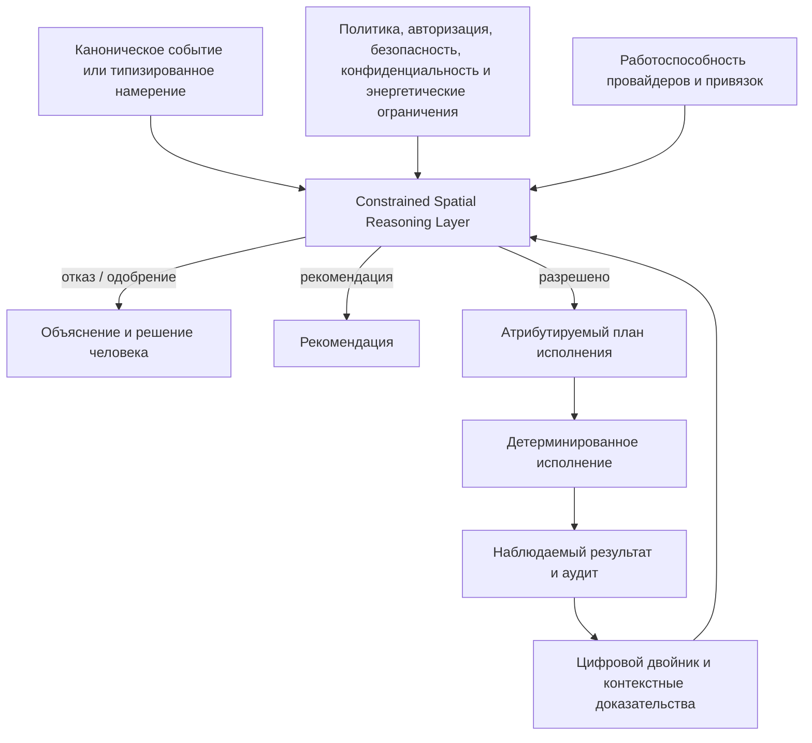

# Слой ограниченного пространственного рассуждения

## Назначение

**Constrained Spatial Reasoning Layer** (CSRL) — возможность OSIP, которая преобразует каноническое наблюдение или типизированное намерение в объяснимое решение для физического пространства, ограниченное политиками. Это намеренно не «слой автоматизации»: простые правила «триггер — команда» полезны как средства исполнения, но сами по себе не понимают пространственный смысл, полномочия актора, безопасность, конфиденциальность, энергетические ограничения или качество актуальных доказательств.

CSRL — продуктовая граница, отличающая OSIP от набора автоматизаций устройств. Провайдеры интеграций связывают платформу с физическим миром; детерминированное исполнение выполняет одобренные команды; CSRL определяет, допустим ли запрошенный результат и как он может быть достигнут в текущем пространственном контексте.

## Входы и результаты

Слой оценивает только канонические атрибутируемые входы:

| Вход | Требуемая интерпретация |
| --- | --- |
| Каноническое событие | Связать наблюдение с объектом, пространством, активом, возможностью, источником, свежестью, качеством и происхождением. |
| Типизированное намерение | Определить запрошенный результат, область действия, актора, временную границу, ограничения и ожидание одобрения. |
| Цифровой двойник и контекст | Разрешить вложенность, семантические зоны, отношения, желаемое/текущее состояние, доказательства присутствия или активности, работоспособность провайдера/привязки. |
| Ограничения | Оценить авторизацию, политику, безопасность, конфиденциальность, энергетику, доступность, операционный режим и состояние ручного override. |

Слой формирует ровно один атрибутируемый результат:

- отказ или запрос одобрения человека с причиной;
- рекомендацию, требующую явного решения актора; либо
- план исполнения с выбранными активами, возможностями, привязками, ограничениями, доказательствами проверки, условиями резервного пути и сроком действия.

## Границы

CSRL владеет сквозным рассуждением о пространстве и объявленных ограничениях. Он не владеет переводом протоколов, приёмом исходной телеметрии, прямыми полномочиями над актуаторами, выпуском идентичностей или второй копией политик.

| Компонент | Отношение к CSRL |
| --- | --- |
| Провайдер интеграции | Поставляет канонические факты и выполняет команды конкретного провайдера после одобренного плана; никогда не определяет общий результат. |
| Цифровой двойник | Поставляет состояние и отношения; не выдаёт разрешение и не выпускает команды. |
| Движок политик | Поставляет авторитетные ограничения и решения; CSRL не может их отменить. |
| Детерминированное исполнение | Исполняет одобренные планы, локальные правила, расписания и жёсткое безопасное поведение; не переинтерпретирует значимую цель. |
| Возможность AI | Может предложить намерение, интерпретацию или ранжированную рекомендацию; её вывод оценивается как вход, а не принимается как полномочие. |
| Приложение/UI | Формулирует результат или показывает объяснение; не обходит слой прямой командой провайдеру. |

## Ограничения рассуждения

Слово «ограниченное» принципиально. Слой не выводит факты или полномочия за пределами доказательств. Он обязан учитывать:

- пространственную область и явно смоделированные отношения;
- свежесть, уверенность, происхождение и конфликты контекстных доказательств;
- роль актора, область авторизации, согласие и требование одобрения;
- политики safety interlock, ручного override, доступности, энергопотребления и операционного режима;
- работоспособность провайдера/привязки, полномочия команды и доказательство завершения; и
- классификацию Local First: результат `edge-required` имеет локальный детерминированный путь, не требующий AI, облака, control plane или Home Assistant.

Если доказательства устарели, противоречивы, недостаточны или политика требует человека, правильный результат — не действие, безопасный резервный путь или запрос одобрения, а не уверенное предположение.

## Детерминированная автоматизация

Детерминированная автоматизация сохраняется, но её область явно ограничена. Она может исполнять ранее принятый план, применять расписание, поддерживать жёсткий локальный предел безопасности или обрабатывать узко определённый технический trigger. Для значимого действия она получает решение CSRL и фиксирует отправку команды, проверку, ошибку и доказательства резервного пути. Она не становится скрытым альтернативным слоем решений с другой семантикой политик.

Поэтому автоматизация Home Assistant остаётся полезной для некритичного удобства на стороне провайдера, тогда как OSIP сохраняет переносимые рассуждения, политики, аудит и пространственную семантику выше провайдеров.

## Объяснимость и аудит

Для каждого значимого решения CSRL фиксирует ссылки на канонические входы; версии цифрового двойника/конфигурации/политик; релевантные пространственные отношения и качество доказательств; актора и результат авторизации; рассмотренные ограничения; выбранные активы, привязки и критерии проверки; решение или отказ; и наблюдаемый результат. Человек должен суметь ответить: *что произошло, где, почему это было разрешено или отклонено, какой путь выбран и был ли результат достигнут?*

## Доказательства reference deployment

Reference Apartment должна проверить один workflow CSRL без AI. Подходящий workflow начинается с пространственного observation или намерения вроде подготовки комнаты к встрече; разрешает комнату, доступные возможности, контекст присутствия/доступа и применимые ограничения; формирует объяснимый план; исполняется локально; проверяет результат; и остаётся безопасным при потере WAN и Home Assistant.

## Связанные документы

- [Намерения, политики и исполнение](intent-policy-and-execution.md)
- [Цифровой двойник](digital-twin.md)
- [Edge Runtime](edge-runtime.md)
- [Архитектура ИИ](../ai/ai-architecture.md)
- ADR-0013 — Constrained Spatial Reasoning Layer
