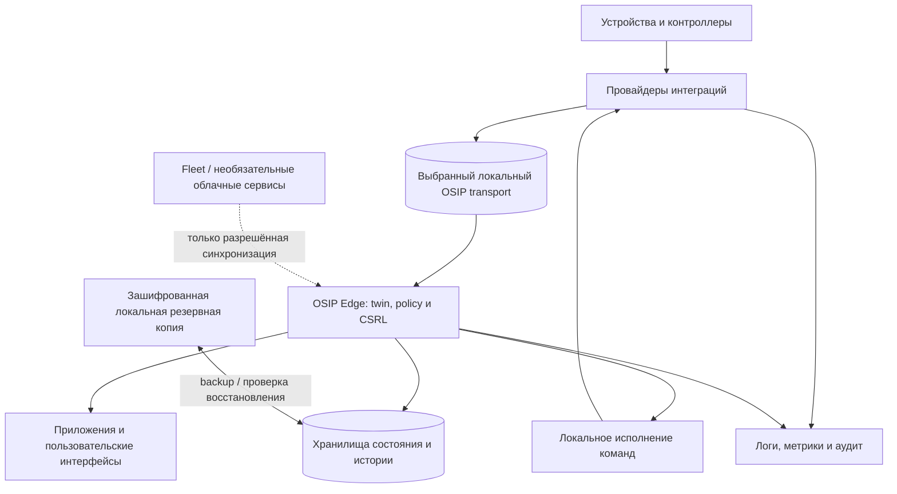

# Архитектура развёртывания

## Назначение

OSIP развёртывает необходимые сервисы в доверенной локальной среде. Эта архитектура определяет размещение сервисов и границы отказов, не предписывая один хост, базу данных, container runtime или облачного провайдера.

## Базовая локальная среда выполнения

Начальное эталонное развёртывание разделяет следующие обязанности: сеть и время; провайдеры интеграций; выбранный локальный OSIP transport; OSIP Edge, digital twin, политики, Constrained Spatial Reasoning Layer и службы детерминированного исполнения; хранилища состояния и истории; приложения/UI; наблюдаемость; инструменты backup/recovery. В reference apartment сервисы могут использовать один достаточно мощный локальный хост, однако их identity, хранилища, credentials, health checks и процедуры восстановления остаются независимыми.

## Доступность и восстановление

Потеря WAN не должна прерывать объявленные Local First-возможности. Потеря отдельной интеграции, хранилища или хоста видна через health-сигналы и должна переводить систему в документированное деградированное состояние. Backup охватывает конфигурацию сервисов, процедуру восстановления секретов, материалы восстановления интеграций/координатора и данные, нужные для заявленной цели восстановления; backup неполон, пока восстановление не проверено.

## Ограничения развёртывания

- Runtime-определения и несекретная конфигурация версионируются и имеют проверяемую историю изменений.
- Секреты, персональные данные, backup координатора и production credentials находятся вне Git.
- У обновлений есть проверка совместимости, решение об откате, при необходимости окно обслуживания и подтверждение health после обновления.
- Облачный egress является явным, минимальным и классифицированным; он не должен незаметно стать зависимостью локального управления.

## Связанные документы

- [Обзор архитектуры](architecture-overview.md)
- [Архитектура безопасности](security-architecture.md)
- [Операции](../operations/README.md)
