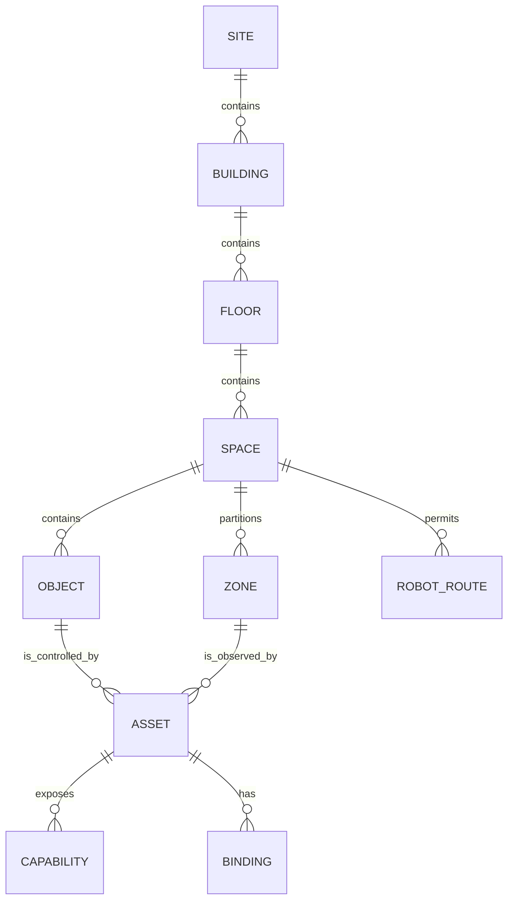

# Цифровой двойник

## Назначение

Цифровой двойник — структурированное представление инсталляции OSIP и её значимых пространственных связей. Он позволяет людям и сервисам говорить о «зоне чтения», «окне рядом со столом» или «месте зарядки робота», не перенося идентификаторы вендоров устройств в модель платформы.

## Слои модели

| Слой | Примеры | Полномочия и способ изменения |
| --- | --- | --- |
| Физическая основа | Site, здание, этаж, границы комнат, двери, постоянные инженерные активы, система координат. | Курируется при проектировании/commissioning; изменения проходят ревью конфигурации. |
| Семантическая модель | Назначение комнат, зоны, именованные объекты, доступность, зоны безопасности. | Принадлежит инсталляции и версионируется как конфигурация. |
| Связи активов | Актив—местоположение, актуатор—объект, поле обзора датчика, привязки провайдеров, док-станции роботов. | Запись commissioning с identity и доказательствами проверки. |
| Текущее состояние | Температура, положение, доказательства присутствия, состояние двери, миссия робота. | Наблюдается провайдерами; имеет время и указание источника. |
| Производный контекст | «зона чтения активна», предполагаемое присутствие, рекомендованная задача. | Производный, с указанием уверенности и свежести; никогда не перезаписывает физические факты. |

## Identity и отношения

Каждая сущность двойника имеет стабильную identity OSIP, тип, владеющий site, состояние жизненного цикла и provenance. Идентификаторы вендоров остаются атрибутами привязка провайдера. Отношения типизированы и при необходимости направлены: `contains`, `adjacent-to`, `located-in`, `covers`, `controls`, `observes`, `serves`, `connects`, `belongs-to` и `reachable-from`.

## Правила согласования

Физические и семантические изменения являются объявленными изменениями конфигурации и проходят ревью, прежде чем стать авторитетными. Текущее состояние — append-only доказательство наблюдения; оно не переопределяет комнату или местоположение устройства. Производный контекст истекает по правилам свежести и уверенности источника. При расхождении нескольких источников или влиянии изменения на безопасность, доступ либо охват автоматизации конфликт показывается оператору.

Первая реализация может использовать небольшой набор комнат и зон. Правила identity, отношений, provenance и изменений вводятся с самого начала, чтобы модель могла вырасти до CAD/BIM-импорта, робототехники или более богатой визуализации без разрушительной миграции.
