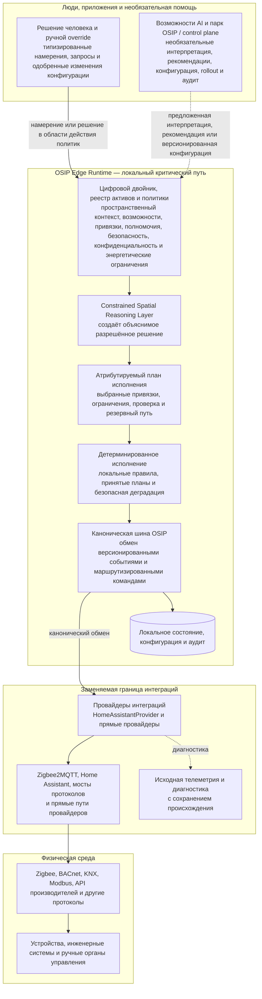

# Сквозная операционная модель

## Назначение

Этот вид объясняет, как OSIP управляет физическим пространством от начала до конца. Он дополняет диаграммы C4: C4 показывает границы систем и контейнеры, а эта диаграмма показывает канонический путь информации и управления. Центральное различие состоит в том, что технологии интеграции связывают OSIP с физическим миром, а **Constrained Spatial Reasoning Layer** определяет, что допустимо сделать в пространстве при явных ограничениях.

## Как читать диаграмму

1. Устройства и инженерные системы взаимодействуют через родные протоколы. Zigbee2MQTT и Home Assistant — полезные пути интеграции, но не зависимости домена OSIP.
2. Провайдеры проверяют привязку актива и преобразуют внешние данные в канонические события OSIP. Исходная телеметрия хранится отдельно для диагностики и повторной обработки.
3. Локальная шина OSIP распространяет канонические факты. Цифровой двойник добавляет пространственный смысл, отношения, свежесть, происхождение и работоспособность.
4. CSRL оценивает запрошенный результат или наблюдаемую ситуацию по цифровому двойнику, политикам, полномочиям актора и качеству evidence. Результатом становится объяснение, рекомендация, отказ, запрос одобрения или план исполнения.
5. Детерминированное исполнение выполняет только разрешённый план через подходящего провайдера, проверяет наблюдаемый результат и фиксирует evidence аудита.
6. Парк/control plane и AI могут улучшать эксплуатацию, но ни один из них не требуется синхронно для объявленного локального критического пути. AI предлагает интерпретацию или намерение; он никогда не выдаёт команду актуатору напрямую.

## Правило локальной непрерывности

Сплошной маршрут внутри OSIP Edge — объявленный путь Local First. Для возможности `edge-required` он должен работать при потере WAN и без зависимости от AI service, control plane или Home Assistant. Пунктирные связи — необязательные пути улучшения, синхронизации конфигурации или рекомендаций.

## Связанные документы

- [Обзор архитектуры](architecture-overview.md)
- [Провайдеры интеграций](integration-providers.md)
- [Слой ограниченного пространственного рассуждения](constrained-spatial-reasoning-layer.md)
- [Edge Runtime](edge-runtime.md)
- [Парк и control plane](fleet-control-plane.md)
