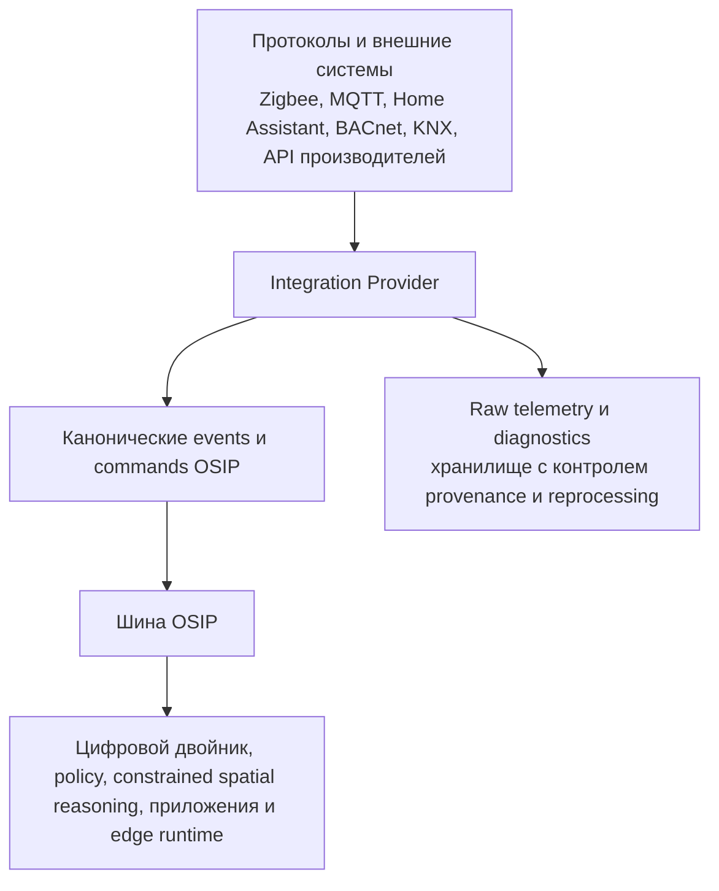

# Провайдеры интеграций и каноническая граница

## Назначение

Провайдер интеграции — ограниченный компонент, который преобразует один внешний продукт, протокол или API в активы OSIP, возможности, канонические события, канонические команды, состояние работоспособности и диагностику. Он позволяет OSIP использовать зрелые экосистемы, не импортируя их идентичность, жизненный цикл, безопасность или модель данных в ядро OSIP.

Home Assistant — первоклассный кандидат на роль провайдера для MVP: он предлагает обнаружение, локальную связь, dashboards, scenes и широкую экосистему интеграций. Но он не является фундаментом OSIP и не обязателен. Прямые провайдеры BACnet, KNX, Modbus, MQTT, Zigbee2MQTT и производителей добавляются, когда конкретное развёртывание докажет необходимость по точности, задержке, надёжности или продуктовой функции.

## Каноническая граница

Всё севернее этой границы использует идентичность активов OSIP, контракты возможностей, канонические имена событий и команд в области действия политик. Для доменных решений оно не должно читать исходные MQTT-топики, `entity_id` Home Assistant, объекты BACnet или payload производителя. Поэтому транспорт находится ниже семантической границы, а не является объединяющим элементом платформы.

## Ответственность Provider-а

1. Обнаруживать или получать внешние endpoints и представлять их как кандидатные привязки.
2. Отображать единицы, timestamps, работоспособность, идентичности и семантику провайдера в явный контракт возможности.
3. Проверять endpoint относительно введённой в эксплуатацию привязки актива до публикации канонического события.
4. Сохранять исходную телеметрию и ссылки на диагностику с происхождением провайдера и контролем доступа.
5. Преобразовывать авторизованную каноническую команду в запрос провайдера и раздельно сообщать о принятии, ошибке, таймауте и наблюдаемом завершении.
6. Сообщать работоспособность провайдера и привязки, информацию о поддерживаемых версиях, ограничениях и режимах деградации.

Провайдеры не владеют авторитетным пространственным графом объекта OSIP, общей политикой, семантикой намерений или автоматизацией между провайдерами. Они также не получают широкие административные права к broker или API только потому, что обрабатывают интеграции.

## HomeAssistantProvider

`HomeAssistantProvider` отображает зарегистрированный экземпляр Home Assistant в кандидатные привязки OSIP. Он может использовать HA для обнаружения, некритичной локальной автоматизации, удобства dashboard и широкого покрытия протоколов. Он отображает сущности HA в контракты возможностей OSIP и выпускает канонические события только после проверки актива/привязки.

Провайдер не может делать сущность HA `asset_id`, зависеть от доступности HA в объявленном критическом loop или раскрывать исходные entities как общий application API OSIP. Если HA не раскрывает необходимую детальность, создаёт неприемлемую задержку, теряет необходимую семантику протокола или является неприемлемой точкой отказа, для одного актива может сосуществовать прямой провайдер.

## Прямые Provider-ы и критерии добавления

Прямой провайдер не создаётся только потому, что существует протокол. Он предлагается, когда доказательства из reference deployment показывают хотя бы одно из следующего: нужная информация недоступна через существующий провайдер; необходимо раскрыть возможность протокола; задержка или доступность недостаточны; критический путь управления должен оставаться независимым; либо OSIP нужно явное владение жизненным циклом/управлением. Предложение фиксирует разницу возможностей, границу безопасности, эксплуатационную нагрузку, test fixtures, путь rollback и причину, по которой существующий провайдер недостаточен.

## Raw telemetry и reprocessing

Канонические events несут нормализованные факты, нужные доменным consumers. Raw telemetry хранится отдельно для diagnostics, health устройств, audit и последующего reprocessing. Она содержит ссылку на Provider, source timestamp, receipt timestamp, schema/version (если известны), integrity status, classification и retention policy. Raw data не публикуются скрытно в широкий domain topic OSIP и не должны попадать в контекст AI или приложений без утверждённой цели.

## Модель результата команды

Получение Provider-ом не является физическим завершением. Provider фиксирует lifecycle команды: `requested`, `accepted-for-dispatch`, `rejected`, `timed-out`, `observed-complete` или `observed-divergent`. Execution plan определяет, какие evidence достаточны для capability и когда безопасны fallback или эскалация человеку.

## Связанные документы

- [Модель физических активов](physical-asset-model.md)
- [Модель событий](event-model.md)
- [Шина сообщений](message-bus.md)
- [Edge Runtime](edge-runtime.md)
- [Zigbee Mesh и MQTT-мост](zigbee-mesh-and-mqtt-bridge.md)
