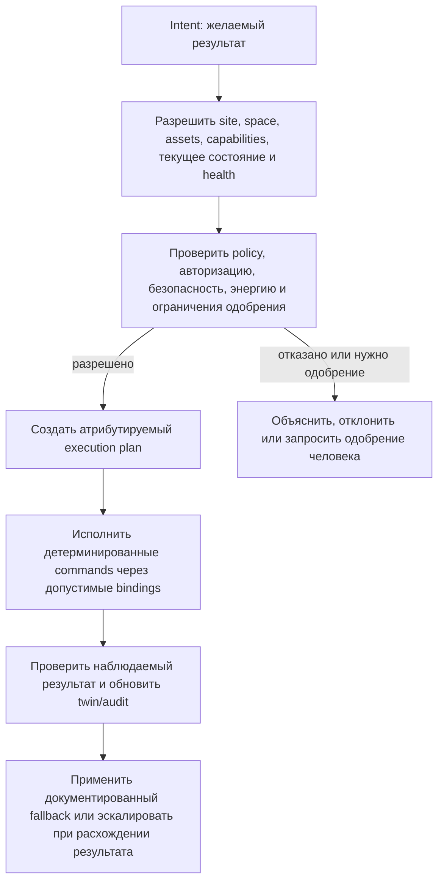

# Намерения, политики и исполнение

## Назначение

OSIP отличает результат, который запрашивает пользователь или приложение, от отдельных команд, нужных для его достижения. Это позволяет управлять пространством через его физическую модель и доступные возможности, а не через фиксированный перечень устройств конкретной интеграции. Это также не даёт вспомогательным функциям, AI или приложениям обходить ограничения безопасности, доступа, энергии и эксплуатации.

## Разделение ответственности

| Область | Чем владеет | Чем не должна владеть |
| --- | --- | --- |
| Цифровой двойник | Текущим/желаемым состоянием, отношениями, происхождением, свежестью и работоспособностью провайдеров. | Полномочиями на разрешение или исполнение. |
| Движок политик | Тем, что разрешено, обязательно, запрещено или требует одобрения. | Переводом исходного протокола или скрытыми побочными эффектами автоматизации. |
| Constrained Spatial Reasoning Layer | Допустимыми возможностями, привязками, пространственными/контекстными доказательствами, ограничениями, резервными путями и объяснимым предлагаемым планом исполнения. | Окончательным правом игнорировать политику, прямыми полномочиями над актуаторами или переводом протоколов. |
| Детерминированное исполнение | Узкими triggers, schedules, жёсткими локальными rules, исполнением принятого плана и проверкой команд. | Скрытой второй моделью политик или самостоятельной интерпретацией значимых целей. |
| Провайдер интеграции | Переводом во внешнюю систему и из неё. | Общим бизнес-намерением или состоянием между провайдерами. |

## Жизненный цикл намерения

Намерение может быть столь конкретным, как «подготовить Room 204 к Meeting Mode», или столь ограниченным, как «поддерживать комфорт во время забронированной встречи в рамках энергетической политики и политики доступа». Оно называет результат, область действия, актора, временную границу, ограничения и, при необходимости, ожидание одобрения. Оно не называет произвольные низкоуровневые команды, если вызывающая сторона не авторизована запрашивать конкретное действие возможности.

## Планы исполнения

План исполнения — устойчивый атрибутируемый record решения, созданный Constrained Spatial Reasoning Layer для одного принятого намерения. Он идентифицирует использованные версии двойника/конфигурации, выбранные активы и возможности, привязки провайдеров, ожидаемые изменения состояния, решения политик, correlation IDs, условия резервного пути, evidence проверки и срок действия. План может быть переоценён, когда меняются работоспособность провайдера, политики, occupancy, access state или другие существенные факты.

План явно выбирает основную привязку и, при необходимости, резервный путь. Например, привязка BACnet может обеспечивать основное управление HVAC, тогда как привязка Home Assistant даёт наблюдаемость и удобство UI. Резервный путь не может активироваться только потому, что доступен: политика определяет условия безопасности и полномочий.

## Детерминированное и значимое для безопасности исполнение

Критические действия остаются локальными, детерминированными и независимо исполнимыми средой OSIP Edge Runtime. Аварийное отключение, ограничение доступа, реакция на протечку или настроенное ограничение HVAC не должны зависеть от cloud access, доступности AI, центрального сервиса парка/control plane или Home Assistant. Движок исполнения обязан сохранять локальную политику, релевантную конфигурацию актива/привязки, область авторизации, желаемое состояние и консервативное поведение при сбое, необходимые для заявленной операции.

## AI и управление человеком

AI может интерпретировать естественный язык, предлагать намерение, ранжировать альтернативы, объяснять план или находить аномалии. Его результат — намерение или recommendation, но никогда не привилегированная команда актуатору. Проверка политик, авторизация, аудит, детерминированное исполнение, manual override и verification результата остаются отдельными. Для значимых действий human interfaces объясняют запрошенный результат, результат политики, выбранный control path и наблюдаемый результат.

## Связанные документы

- [Модель физических активов](physical-asset-model.md)
- [Цифровой двойник](digital-twin.md)
- [Слой ограниченного пространственного рассуждения](constrained-spatial-reasoning-layer.md)
- [Edge Runtime](edge-runtime.md)
- [Архитектура AI](../ai/ai-architecture.md)
- [Архитектура безопасности](security-architecture.md)
