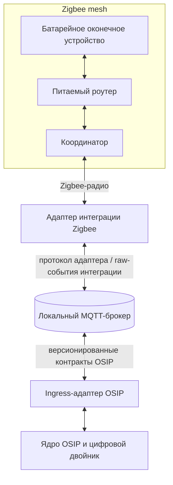

# Zigbee Mesh и MQTT-мост

## Назначение

Эта спецификация определяет границу между сетью Zigbee-устройств и локальным event backbone OSIP. Она предотвращает распространённое, но существенное заблуждение: **Zigbee Mesh и MQTT — не конкурирующие mesh-сети и не один и тот же слой.**

Zigbee — маломощная сеть устройств IEEE 802.15.4. Её mesh передаёт радиотрафик между устройствами и координатором. MQTT — начальный локальный транспорт прикладных сообщений OSIP: клиенты публикуют сообщения брокеру и подписываются на него. MQTT может работать поверх Ethernet или Wi-Fi, но OSIP не называет его mesh-сетью.

## Архитектурное место

Сеть Zigbee относится к слою интеграции физических устройств. Адаптер интеграции открывает шине сообщений OSIP свои наблюдения и принятые команды. Первоначально адаптером может быть Zigbee2MQTT; Home Assistant ZHA, коммерческий gateway или иная реализация могут его заменить, если сохраняют контракт интеграции OSIP.

Нижняя радиограница и верхняя граница контрактов OSIP имеют разные режимы отказа, identity, меры безопасности и семантику доставки. Их необходимо наблюдать раздельно.

## Роли сети Zigbee

| Роль | Интерпретация OSIP | Эксплуатационное ожидание |
| --- | --- | --- |
| Координатор | Единственный корень радиосети, подключённый к адаптеру интеграции. | Его backup, совместимость firmware, канал, параметры PAN и ключ сети — активы commissioning. Это не доменный сервис OSIP. |
| Роутер | Обычно постоянно питаемое Zigbee-устройство, способное ретранслировать пакеты. | Размещается намеренно для покрытия и резервных путей; его доступность влияет на соседние батарейные устройства. |
| Оконечное устройство | Обычно батарейный датчик, кнопка, замок или актуатор, не ретранслирующий трафик. | Не используется для расширения покрытия. Сон, polling и разряд батареи могут временно сделать его недоступным без отказа ПО OSIP. |

Точная роль, радиовозможности и поведение производителя — обнаруженные факты, а не предположения по категории продукта. Устройство с питанием от сети не становится автоматически полезным роутером, а заявляющее роутинг устройство всё равно проверяется в эталонной инсталляции.

## Правила топологии и установки

Качество mesh проектируется до настройки логики автоматизации. В инсталляции reference apartment фиксируются местоположение координатора, радиоканал, места роутеров, зависимости питаемых устройств, известные RF-препятствия и приёмочный обход всех предполагаемых мест устройств.

Предпочтительная последовательность развёртывания:

1. Выбрать место координатора с подходящими USB, питанием, хостом и радиодистанцией от источников помех.
2. Установить и стабилизировать питаемые роутеры рядом с координатором и вдоль намеченных путей покрытия.
3. Подключать батарейные оконечные устройства только после здоровой основы из роутеров.
4. Проверить задержку команд, отчётность, восстановление маршрутов после перезапуска роутера и восстановление после перезапуска адаптера.
5. Зафиксировать проверенную топологию и инвентарь устройств в reference design и доказательствах инсталлятора.

Добавление или перемещение питаемых устройств может изменить доступные маршруты. Поэтому изменение commissioning — это эксплуатационное изменение: проверяйте затронутую область и обновляйте запись об инсталляции, а не считайте успешное сопряжение доказательством надёжного покрытия.

## Сопоставление identity и состояния

Радиоидентификаторы не становятся идентификаторами OSIP без изменений. Адаптер может наблюдать адрес IEEE/EUI-64, изменяемый короткий сетевой адрес, пару производитель/модель, идентификаторы endpoint и cluster и заданное пользователем дружественное имя. OSIP ведёт стабильный `device_id` и связывает его с этими интеграционными идентификаторами через контролируемое сопоставление.

Короткие сетевые адреса и дружественные имена — атрибуты интеграции: они могут измениться после повторного подключения, замены или повторного commissioning. Сопоставление сохраняет источник, время первого и последнего наблюдения и статус жизненного цикла. Замена физического устройства требует явного процесса инсталлятора или администратора, а не молчаливого присвоения новому устройству прежней identity.

Цифровой двойник использует нормализованные возможность и состояние, например `occupancy`, `illuminance`, `switch`, `level` или `contact`. Он сохраняет источник, время наблюдения, качество и информацию о связности. Raw-кластеры, расширения вендоров и специфичные payload адаптера доступны для диагностики, но не попадают в общие контракты автоматизации.

## Поток событий и команд

Наблюдение идёт от устройства по Zigbee mesh к координатору, затем через адаптер и MQTT-границу интеграции. Ingress-адаптер OSIP проверяет источник, сопоставляет identity интеграции с `device_id`, нормализует payload и публикует версионированное событие OSIP. Команда следует обратным путём, а её результат наблюдается отдельно; принятие MQTT не доказывает, что Zigbee-актуатор завершил действие.

Для каждой поддерживаемой возможность контракт интеграции определяет:

- схему и версию нормализованных команды и события;
- ключи корреляции и идемпотентности;
- целевой MQTT QoS и уместность retained state;
- таймаут и наблюдаемое доказательство завершения;
- представление недоступных, устаревших, некорректных и неподдерживаемых состояний; и
- raw-диагностическую ссылку, нужную для расследования ошибок трансляции.

Повторы Zigbee и MQTT QoS решают разные части доставки. Любой слой может продублировать, задержать или потерять сообщение. Поэтому обработчики команд и проекции состояния OSIP должны быть идемпотентными и учитывать время. Retained MQTT-данные удобны для проекции состояния, но никогда не доказывают достижимость спящего устройства в данный момент.

## Границы доверия и секреты

Ключ сети Zigbee, backup координатора, credentials адаптера, credentials брокера и credentials сервисов OSIP — разные секреты. Ни один не хранится в Git или на диаграмме. Доступ адаптера к MQTT ограничен нужными ему integration topics; ingress-адаптер OSIP получает отдельные credentials для публикации нормализованных контрактов. Общие сервисы OSIP не получают неограниченного доступа к raw control topics адаптера.

Хост координатора и адаптер входят в доверенную локальную среду. Их доступность, health адаптера, ошибки авторизации брокера, время последнего наблюдения устройств, симптомы маршрутизации и сигналы батарей — наблюдаемые эксплуатационные сигналы. Потеря связи с облаком не должна прерывать локальное управление Zigbee по локальному пути.

## Независимость от вендора и технологии

OSIP не требует от каждого устройства Zigbee и не делает доменную модель зависимой от Zigbee-кластеров. Matter, Thread, ESPHome, проводные шины или gateway вендоров могут предоставлять те же контракты возможность OSIP через собственные адаптеры. Zigbee остаётся сильным начальным выбором для маломощных локальных устройств, если reference design подтверждает его радиотехнические и эксплуатационные ограничения.

Аналогично, Zigbee2MQTT не является ядром OSIP. Он ценен тем, что может подключить широкий экосистемный Zigbee к локальному MQTT, но его raw topic taxonomy и соглашения об именах остаются заботой адаптера. Замена допустима только после проверки совместимости, commissioning, безопасности и наблюдаемости.

## Последствия для reference apartment

Reference apartment должен считать Zigbee mesh документированной подсистемой, а не невидимым транспортом. Reference design включит схему радиотопологии, обоснование размещения координатора и роутеров, реестр интеграций, нормализованную матрицу возможность, чек-лист commissioning и запись тестов восстановления после отказов. Эти артефакты затем станут входными данными Installer Edition.

## Связанные спецификации

- [Обзор архитектуры](architecture-overview.md)
- [Модель устройств](device-model.md)
- [Модель событий](event-model.md)
- [Шина сообщений](message-bus.md)
- [Цифровой двойник](digital-twin.md)
- [Архитектура безопасности](security-architecture.md)
