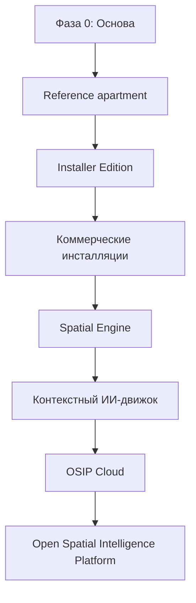

# Дорожная карта

## Правило планирования

Дорожная карта строится вокруг возможность, а не дат. Даты становятся обязательствами только после определения зависимостей, владельцев, доказательств приёмки и эксплуатационных ограничений. Фаза может пересекаться с исследованием следующей, но не может объявить успех лишь выпуском документов или прототипов.

## Фазы и критерии выхода

### Фаза 0 — Основа

Создать Charter, принципы, workflow документации, набор ADR, обзор архитектуры, направление основной модели, базовый уровень безопасности и подход к оценке технологий. Выход — когда начальный reference deployment, сейчас Reference Apartment, может принимать ограниченные решения, не противореча базовой линии.

### Reference Apartment

Построить и эксплуатировать лабораторию 165 м² как документированную систему. Выход — когда в реалистичных условиях доказаны основное локальное управление, поток событий, доказательства commissioning, эксплуатационный мониторинг и восстановление после отказов.

### Installer Edition

Упаковать поддерживаемые reference patterns в повторяемые workflow commissioning и поддержки. Выход — когда обученный инсталлятор может поставить ограниченное развёртывание без недокументированного знания основателя.

### Коммерческие инсталляции

Проверить предположения о поставке, поддержке, ценах, партнёрах и жизненном цикле в инсталляциях заказчиков. Выход — когда интерфейсы платформы и паттерны поддержки доказуемо переиспользуемы.

### Возможности платформы

Spatial Engine, AI Context Engine и OSIP Cloud развиваются из подтверждённых потребностей. Каждый должен сохранять Local First, иметь версионированные контракты и давать измеримую ценность сверх автоматизации на уровне устройств.
